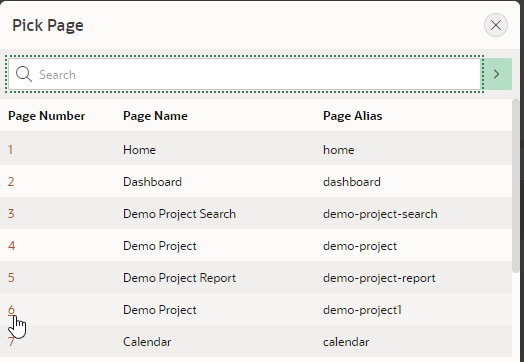
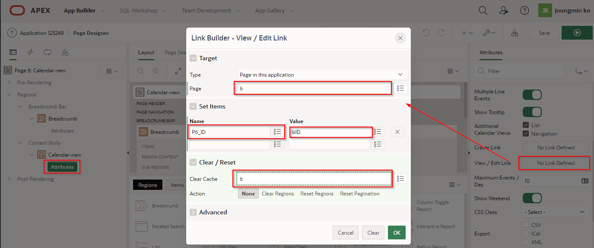

# Module 3: 일정 관리 페이지 추가

'**모듈 3**'에서는 기존 애플리케이션에 일정 관리(달력) 페이지를 추가해 볼 것입니다. 그리고 달력 데이터를 업데이트하는 페이지를 연결해 볼 것입니다. 

### **Part 1** - 일정 관리 페이지 추가

TODO.
1. 개발 환경으로 이동합니다. 'App Builder'에서 'App from a Spreadsheet'를 클릭합니다. 그리고 '**Create Page**' 버튼을 클릭합니다. 

    

2. 'Create Page' 팝업창에서 '**Calendar**' 아이콘을 클릭합니다.
    

3. 'Page Name' 항목에 '**Calendar**'라고 설정합니다. 'Breadcrumb' 항목에 대해서는 '**Breadcrumb**'을 선택합니다. 그리고 '**Next**' 버튼을 클릭합니다.  

    

4. 내비게이션 설정에서는 '**Create a new navigation menu entry**'를 선택하고, 추가 변경 없이 '**Next** 버튼을 클릭합니다.

     

5. 4번째에 위치하는 'Table / View Name' 항목에 '**DEMO_PROJECT (table)**'을 선택합니다. 그리고 **Next** 버튼을 클릭합니다.   
    

6. 'Display Column' 항목에 '**TASK_NAME**'을 선택합니다. 'End Date Column' 항목에 '**END_DATE**'을 선택합니다. 그리고 '**Create**' 버튼을 클릭합니다.

    

### **Part 2** – 일정 관리 페이지에 수정 폼  연결

1. 왼편의 'Rendering' 탭의 Calendar 아래의 '**Attributes**'를 선택합니다.
2. 그리고 오른쪽에 위치하는 'Settings'의 'Property Editor'에서 '**View / Edit Link**' 항목의 "No Link Defined" 버튼을 클릭합니다. 
3. 'Page' 항목에 **3**을 지정합니다.
4. 'Set Items'의 Name 속성에 '**P3_ID**'를 지정합니다. 'Value'에는 '**ID**'를 선택합니다..
5. 'Clear Cache'를 '**3**'으로 설정합니다.
6. '**OK**' 버튼을 클릭합니다. 그리고 페이지의 오른쪽 상단에 위치하는 파란색 바탕의 동그라미 세모 아이콘(**Save and Run**) 버튼을 클릭합니다.

    
    

      
    
    **주의: 프로젝트의 시작 시점은 확인하기 위해서는 2019년 5월로 이동해야 합니다.**

## Summary

**Module 3**까지 완료했습니다. 지금까지 데이터 파일을 서버에 올려 애플리케이션을 생성하고, '**Runtime Environment**'와  'Page Designer'를 사용하여 웹 페이지를 개선했습니다. 그리고 애플리케이션 기능을 향상하기 위해서 새로운 페이지를 추가하고 기존 애플리케이션에 연결해 보았습니다. 

## **추가 자료** - *유용한 링크*

- Autonomous와 APEX  https://apex.oracle.com/autonomous
- APEX 사이트  http://apex.oracle.com
- 튜토리얼  https://apex.oracle.com/en/learn/tutorials
- Community  http://apex.oracle.com/community
- 공개 사이트 + 슬랙  http://apex.world

