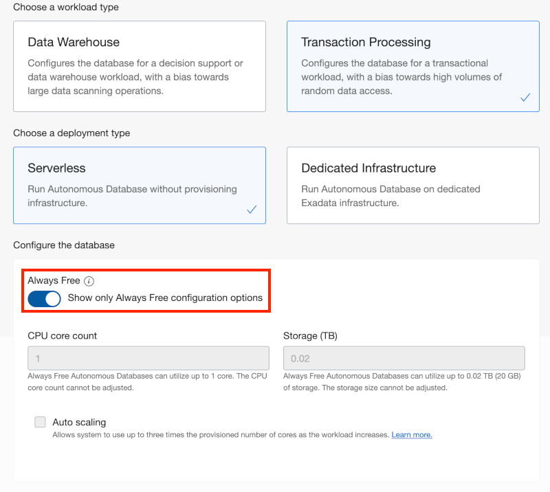
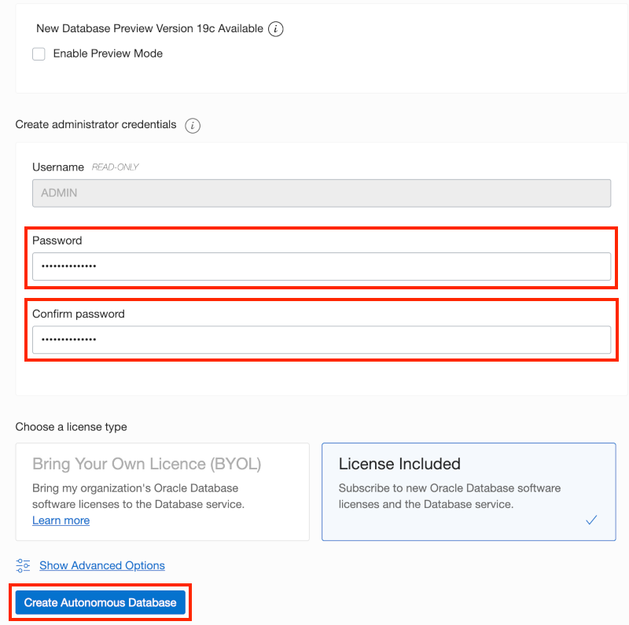
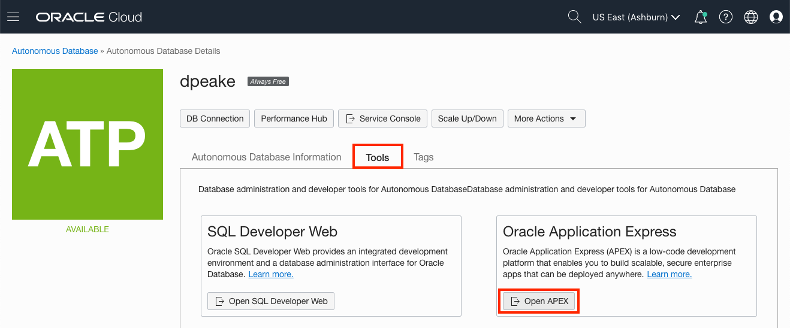
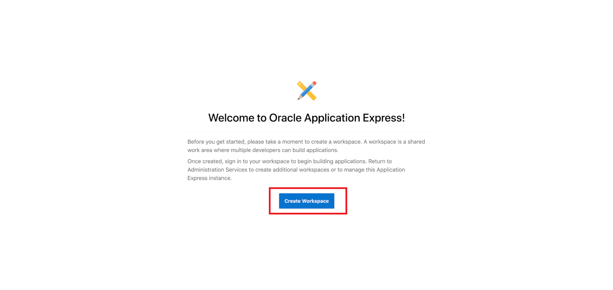
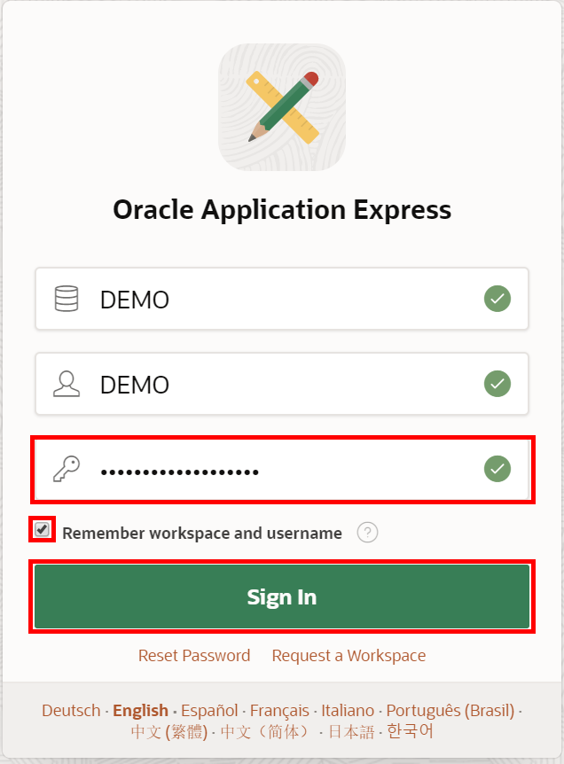
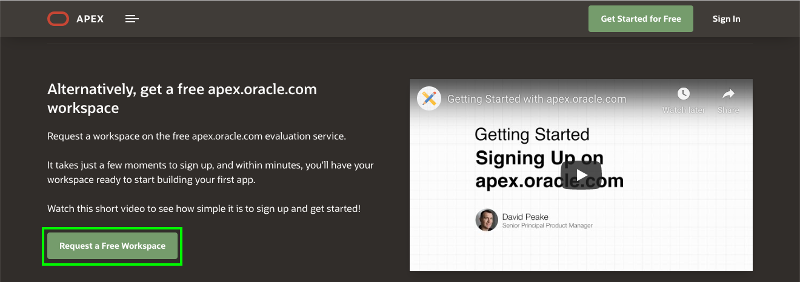
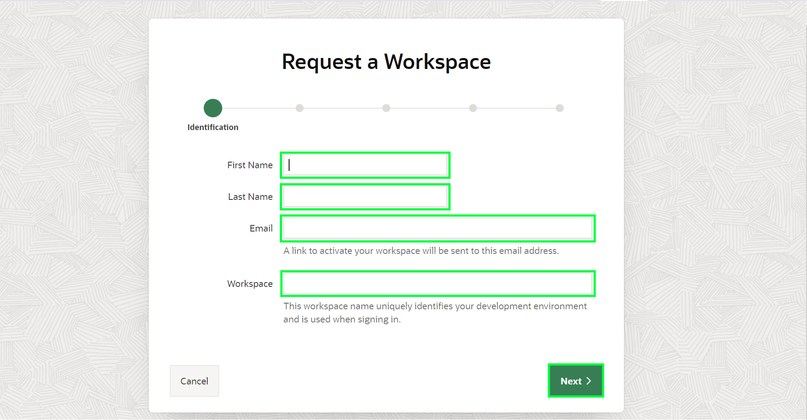
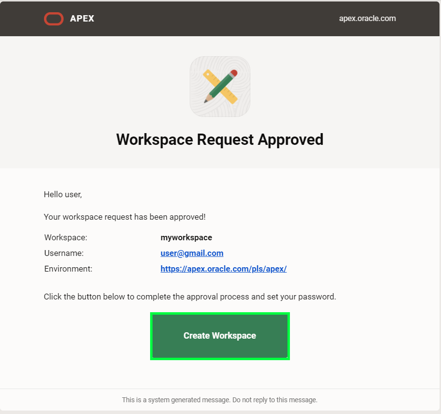
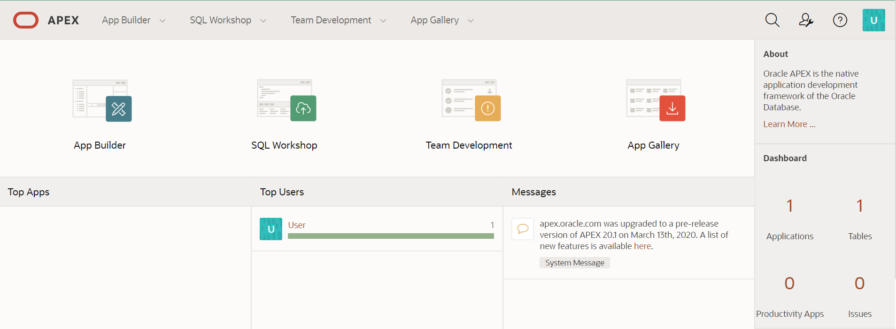

# 모듈 1 : APEX Workspace 생성
* 생성 방법 1 - Always Free Tier  [바로가기](#opt_1)
* 생성 방법 2 - Free Workspace  [바로가기](#opt_2)
---
Oracle Application Express (APEX)는 Oracle 데이터베이스의 기능으로 Autonomous Data Warehouse(ADW)와 Autonomous Transaction Processing(ATP) 서비스에 포함되어 있습니다. APEX 시작을 위해 실습에 사용할 Oracle 데이터베이스를 결정한 다음 해당 데이터베이스에 APEX의 Workspace를 생성합니다.

만약 APEX 19.2 Workspace를 이미 생성해 뒀으면 이 과정은 건너뛰고 모듈 2로 바로 이동하시면 됩니다.

## APEX Workspace 는 무엇인가요?

APEX Workspace는 APEX 애플리케이션을 정의하는 논리적인 도메인 입니다. 각 workspace는 데이터베이스의 테이블, 뷰, 패키지 등의 object들을 저장하는데 사용되는 하나 이상의 데이터베이스 스키마와 연관되어 있습니다. 이러한 데이터베이스 object들은 일반적으로 APEX 애플리케이션을 기반으로 구축되는것 입니다.

## APEX 실습을 실행하는 방법

APEX 19.2가 설치된 Oracle 데이터베이스에서 이 랩을 실행할 수 있습니다. ***Always Free*** Oracle Autonomous Databse 에서 제공하는 **Oracle APEX** 또는 **apex.oracle.com** 의 무료 서비스 그리고 APEX 19.2가 설치된 Oracle 데이터베이스, 타사 클라우드, Oracle XE 또는 Oracle VirtualBox App Dev VM과 APEX 19.2를 노트북에 설치해서 APEX 를 실행할 수 있습니다.

---
<!--## 옵션 1 : Oracle Autonomous Database -->
##
 옵션 1 : Oracle Autonomous Database

이 파트에서는 Oracle Cloud 트라이얼 계정을 생성할 것입니다. 서비스에 가입한 후 Autonomouse Transaction Processing 데이터베이스를 생성할 것입니다. 그리고 이 프로세스의 마지막 단계에서 Oracle APEX를 프로비저닝 합니다.

1. [무료계정 생성을 위해 이 링크](https://myservices.us.oraclecloud.com/mycloud/signup?language=en&sourceType)를 클릭하세요. 등록 절차를 완료하면 $300 크레딧과 이번 실습을 위한 ***Always Free*** 서비스들을 제공받게 됩니다. 그리고 Oracle 클라우드의 남은 크레딧은 계속해서 사용할 수 있습니다. Always Free 서비스는 트라이얼 기간이 만료가 된 이후에도 계속 동작 됩니다.

2. 평가판 요청을 완료하면 **Get Started Now with Oracle Cloud**라는 내용의 메일이 발송됩니다. **사용자명(Username), 패스워드(Password)** 그리고 **어카운트명(Cloud Account)**을 기억해두세요.

   

3. 이제 Oracle Cloud 서비스가 생성됐으므로 Oracle Cloud 계정에 로그인하여 다양한 서비스를 사용할 수 있도록 합니다.

   브라우저에서 https://www.oracle.com/cloud/sign-in.html 로 접속합니다.

   입력란에 **Cloud Account Name**을 입력하고 **``Next``** 버튼을 클릭합니다.

   

4. **User Name** 과 **Password** 를 입력 후 **``Sign In``** 버튼을 클릭 합니다.

   

5. 이제 Oracle Cloud 환경에서 Autonomous Transaction Processing 데이터베이스 서비스 인스턴스를 생성합니다.

   클라우드 콘솔의 왼쪽 상단 모서리에 있는 메뉴 탐색 아이콘을 클릭한 다음 **Autonomous Transaction Processing** 메뉴를 클릭하세요.

   

6. **``Create Autonomous Database``** 버튼을 클릭하세요.

   

7. **Always Free** 옵션 선택, ADMIN password 입력 후 **``Create Autonomous Database``** 버튼을 클릭하세요.

   

   

   

8. Create Autonomous Database 버튼을 클릭하면 신규 생성하는 Autonomous Database 인스턴스의 세부 정보 페이지로 리다이렉션 됩니다.

   인스턴스 상태가 PROVISIONING 상태에서

   

   AVAILABLE 상태로 변경될때 까지 기다립니다.

   

9. 신규 Database내에 APEX는 아직 구성되지 않았습니다. 따라서 APEX에 처음 접속하기 위한 workspace를 생성하려면 APEX 인스턴스의 관리자로 로그인해야 합니다.

   **``Tools``** 클릭.

   **``Open APEX``** 버튼 클릭.

   

10. 관리자 패스워드 입력 후 **``Sign In to Administration``** 버튼을 클릭합니다.

    패스워드는 ATP 인스턴스를 생성할때 입력했던 ADMIN 패스워드와 동일합니다.

    

11. **``Create Workspace``** 버튼을 클릭합니다.

    

12. Create Workspace 다이얼로그에서 아래와 같이 입력합니다.

    - Database User : DEMO
    - Password : ATP ADMIN 패스워드와 동일
    - Workspace Name : DEMO

    **``Create Workspace``** 버튼을 클릭합니다.

    

13. APEX 인스턴스 관리자 화면 상단의 메시지에서 **DEMO** 링크를 클릭합니다.

    *( 참고 : 신규 workspace 에 로그인 할 수 있도록 APEX Administration 에서 로그아웃 하세요. )*

    

14. APEX Workspace 로그인 화면에서 패스워드 입력, **Remember workspace and username** 체크, 그리고 **``Sign In``** 버튼을 클릭하세요.

    

    
---
<!-- ## 옵션2 : apex.oracle.com -->
## 
 옵션 2 : apex.oracle.com

본인이 만들고자 하는 workspace에 대한 세부사항을 제공한 후 승인 이메일 기다리는 간단한 방법으로 apex.oracle.com 에 등록할 수 있습니다.

1. [https://apex.oracle.com](https://apex.oracle.com/) 에 접속합니다.

2. **``Get Started for Free``** 버튼을 클릭합니다.

   

3. apex.oracle.com 에 대한 설명이 있는 부분까지 스크롤을 내린 후  **``Request a Free Workspace``** 버튼을 클릭합니다.

   

4. **Request a Workspace** 다이얼로그에서 사용자 상세 정보를 입력합니다. First Name, Last Name, Email, Workspace

   *( 참고 : workspace의 경우 고유한 이름을 입력하세요. )*

   **``Next``** 버튼을 클릭합니다.

   

5. 남아있는 스텝들을 모두 완료 합니다.

6. 이메일을 확인하세요. 몇분이내 oracle-application-express_ww@oracle.com에서 메일을 수신할 것 입니다.

   *( 참고 : 만약 이메일을 수진하지 못한다면 3번으로 가셔서 이메일을 정확이 입력했는지 확인하세요. )*

   이메일 본문에 있는 **``Create Workspace``** 버튼을 클릭합니다.

   

7. **``Continue to Sign In Screen``** 버튼을 클릭하세요.

8. 사용할 패스워드를 입력한 후 **``Apply Changes``** 버튼을 클릭하세요.

9. 이제 **APEX Builder** 에 접속했습니다.

   

## 요약

실습을 위한 셋업을 완료했습니다. 이제 여러분은 APEX Workspace 를 생성하는 방법을 배웠으며, 뛰어난 애플리케이션을 빠르게 구축할 수 있는 준비가 되었습니다. [모듈 2로 이동](Module2.md)하세요.
