# 모듈 3 : 애플리케이션 생성 - Create Application Wizard 사용

이 모듈에서는 Oracle 데이터베이스의 기존 테이블을 사용해서 초기 애플리케이션을 생성하는 방법에 대해 배우게 됩니다. 실제로 애플리케이션을 생성할 때에는 일반적으로 한 두 페이지로만 시작한 다음 **Create Page Wizard** 를 사용하여 애플리케이션에 페이지를 추가합니다.

## **파트 1** - 애플리케이션 생성

1. APEX 메인화면에서 **App Builder** 메뉴를 클릭한다.

2. **Create** 메뉴를 클릭한다.

   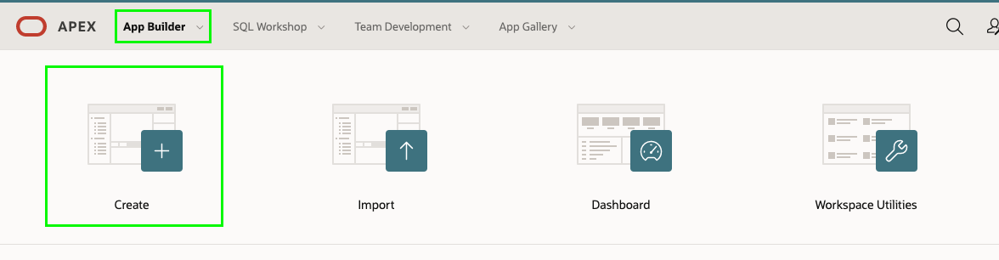

3. **``New Application``** 를 클릭한다.

   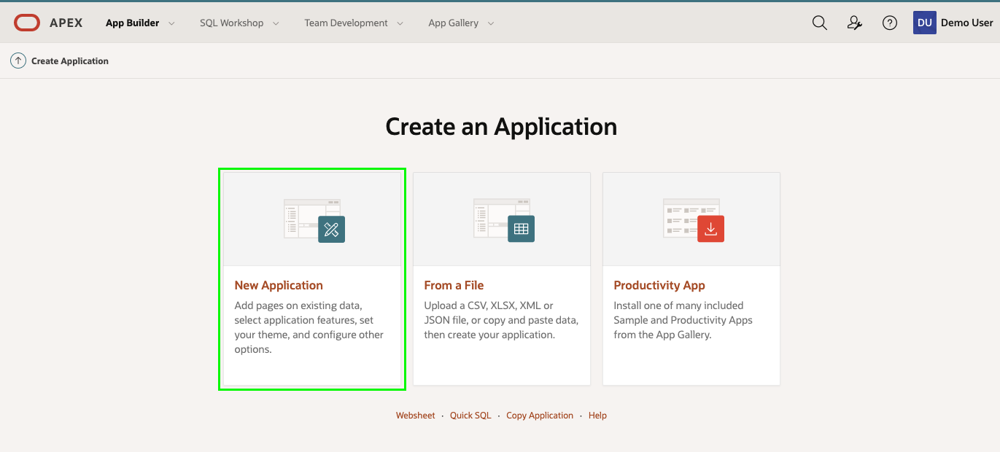

   

## **파트 2** - 애플리케이션 이름 설정

1. Create an Application 화면에서 Name 항목에 **Projects** 를 입력한다.

2. **Appearance** 를 클릭한다.

   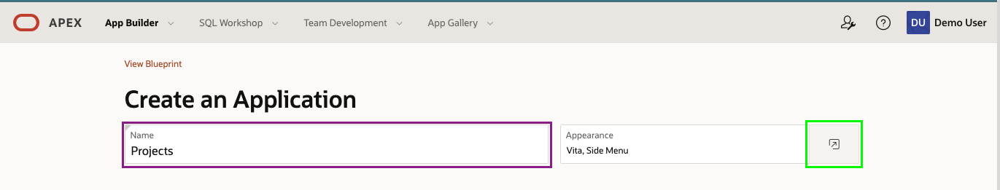

3. Appearance 다이얼로그에서 Theme Style을 **``Vita – Slate``** 로 선택한다.

4. **``Choose New Icon``** 버튼을 클릭하세요.

   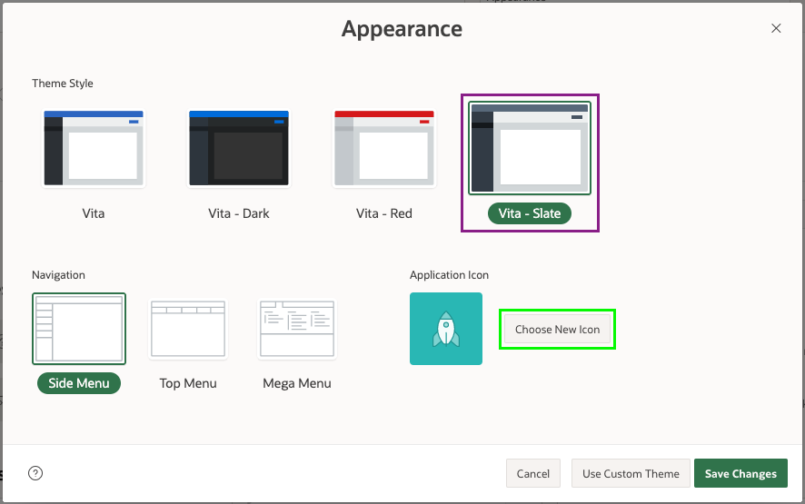

5. Choose Application Icon 다이얼로그에서 여러분이 원하는 아이콘 색상과 종류를 선택합니다.

   **``Set Application Item``** 버튼을 클릭하세요.

   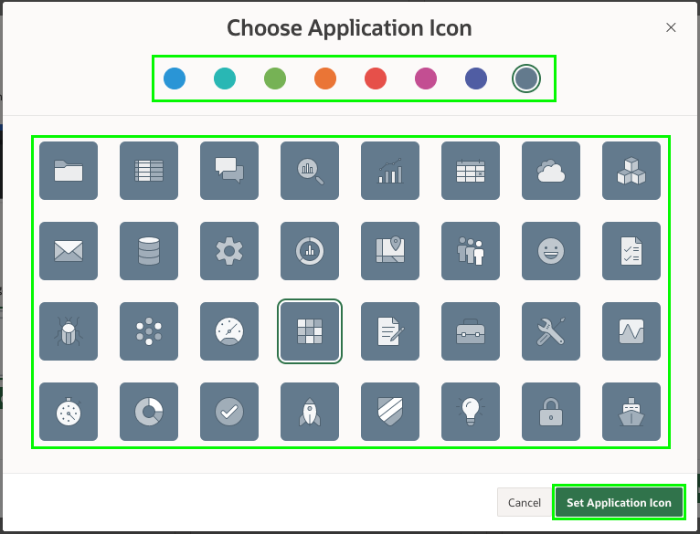

6. **``Save Changes``** 버튼을 클릭하세요.

   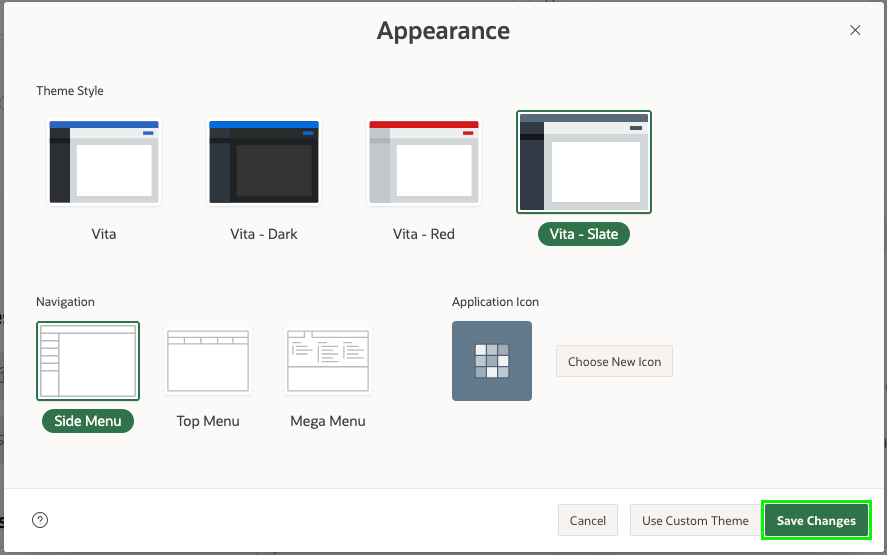

## **파트 3** – Dashboard 페이지 추가

Dashboard 페이지는 다양한 차트를 사용하여 중요한 정보를 보여주는 좋은 방법입니다. 샘플 데이터셋을 생성할 때 다양한 테이블의 데이터를 조인해 놓은 **EBA_PROJECTS_V** 뷰도 생성 되었습니다. 이 뷰는 Dashboard 차트의 기반으로 사용하기 이상적입니다.

1. Create an Application 도구에서 **Add Page**를 클릭하세요.

2. **Dashboard**를 선택하세요.

   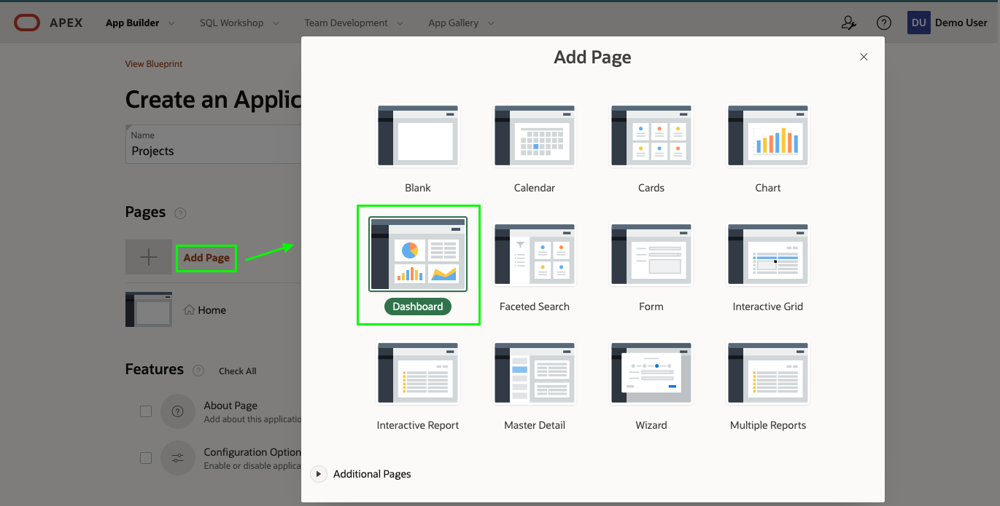

   * **Chart 1** 에서 아래와 같이 입력하세요.

     * Chart Type : **Bar** 선택

     * Chart Name : **Budget versus Cost** 입력

     * Table or View : **EBA_PROJECTS_V** 선택

     * Label Column : **NAME** 선택

     * Value Column : **BUDGET_V_COST**선택

       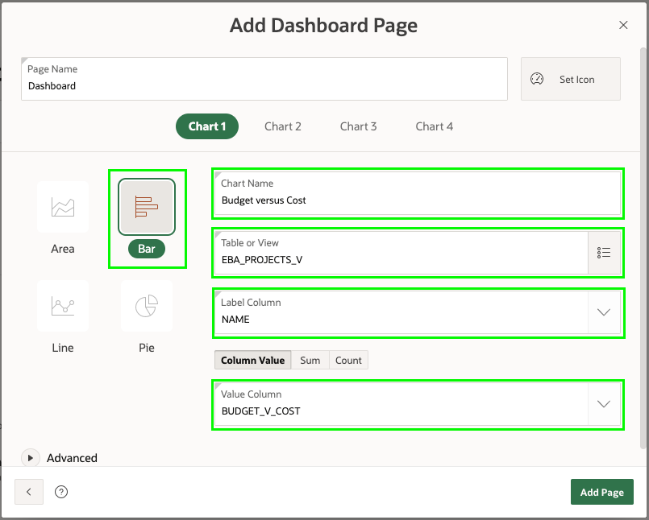

   * **Chart 2**를 클릭한 후 아래와 같이 입력하세요.

     - Chart Type : **Pie** 선택

     - Chart Name : **Project Status** 입력

     - Table or View : **EBA_PROJECTS_V** 선택

     - Label Column : **Status** 선택

     - Type : **Count** 선택

       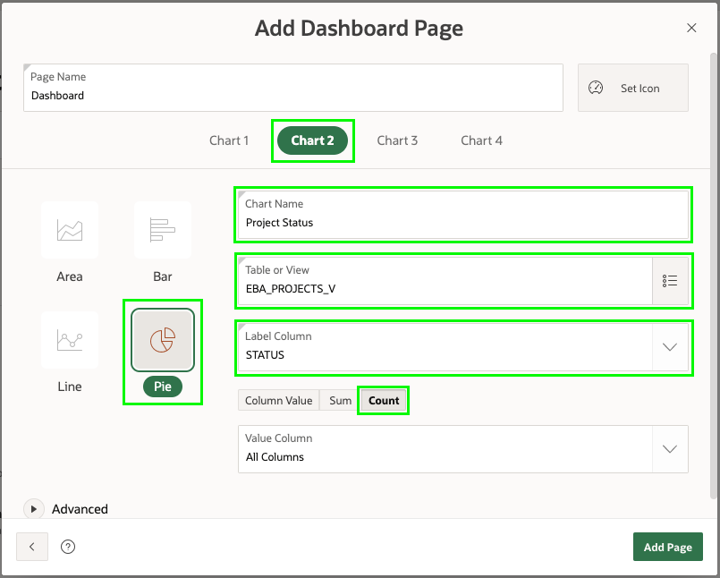

   * **Chart 3** 클릭 후 아래와 같이 입력하세요.

     - Chart Type : **Bar** 선택
     - Chart Name : **Project Leads** 입력
     - Table or View : **EBA_PROJECTS_V** 선택
     - Label Column : **PROJECT_LEAD** 선택
     - Type : **Count** 선택

   * **``Add Page``** 버튼을 클릭하세요.

     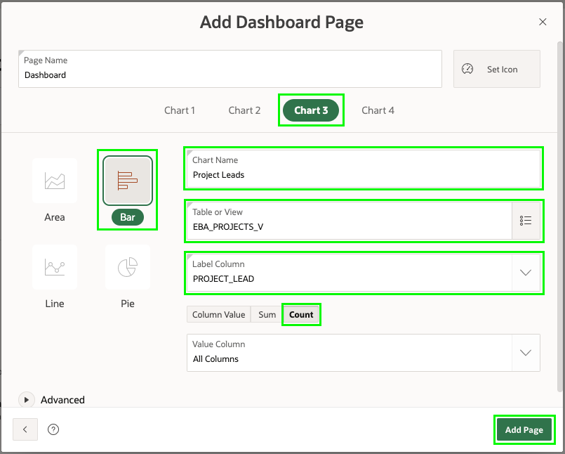

     *( 참고 : Chart 4에 대한 값을 설정하지 않았습니다. 따라서 데모 데이터에 기반한 차트로 생성됩니다. 이후에 진행할 모듈에서 추가적인 차트는 삭제할 것입니다. )*

## **파트 5** – 프로젝트 페이지 추가

Cards 페이지는 특히 데이터가 많지 않을때 좋고 몇 가지 세부사항만 표시하고자 할 때 좋습니다. **EBA_PROJECTS** 테이블은 12개의 레코드만 가지고 있으며 카드 페이지에서 잘 동작할 것입니다.

1. Create Application 화면에서 **Add Page** 를 클릭.

2. **Cards** 를 선택.

   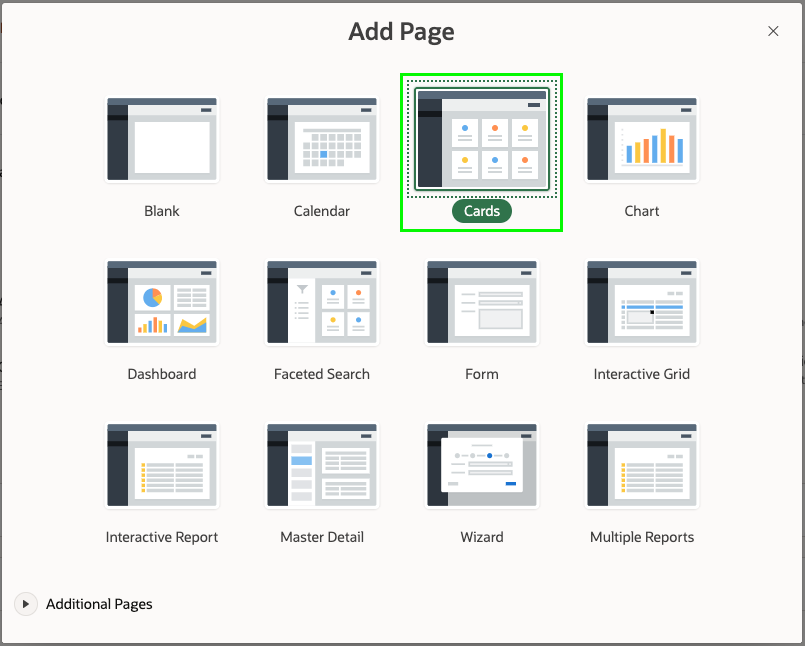

3. Add Cards Page에서 아래와 같이 입력하세요

   - Page Name : **Projects** 입력
   - Table : **EBA_PROJECTS** 선택
   - Card Title : **NAME** 선택
   - Description : **Description** 선택
   - Additional Text : **PROJECT_LEAD** 선택
   - **``Add Page``** 버튼을 클릭하세요.

   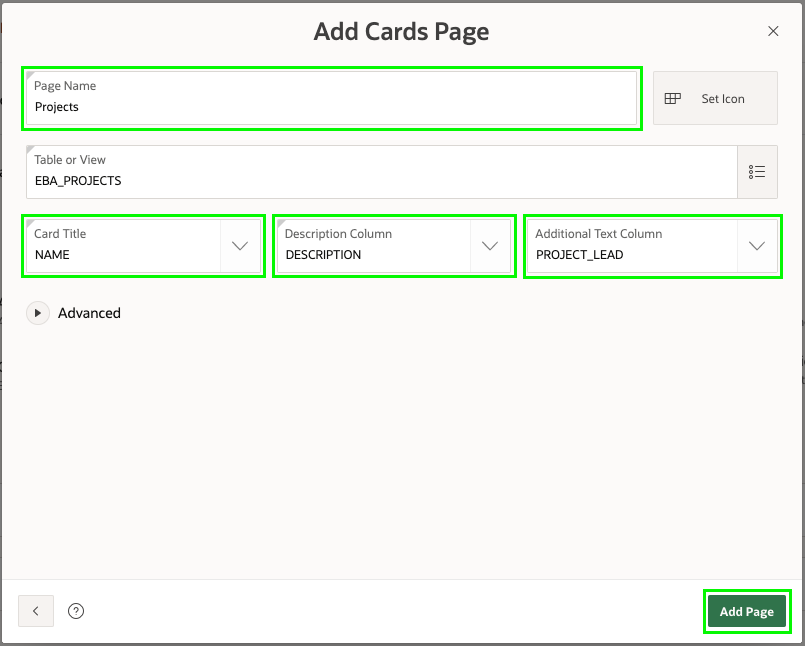

## **파트 6** - 마일스톤 페이지 추가하기

**EBA_MILESTONES** 에는 30개의 레코드가 존재합니다. 따라서 레포트 페이지와 관련된 페이지 양식을 추가하세요.

1. Create Application 화면에서 **Add Page** 를 클릭하세요.

2. **Interactive Report** 를 선택하세요.

   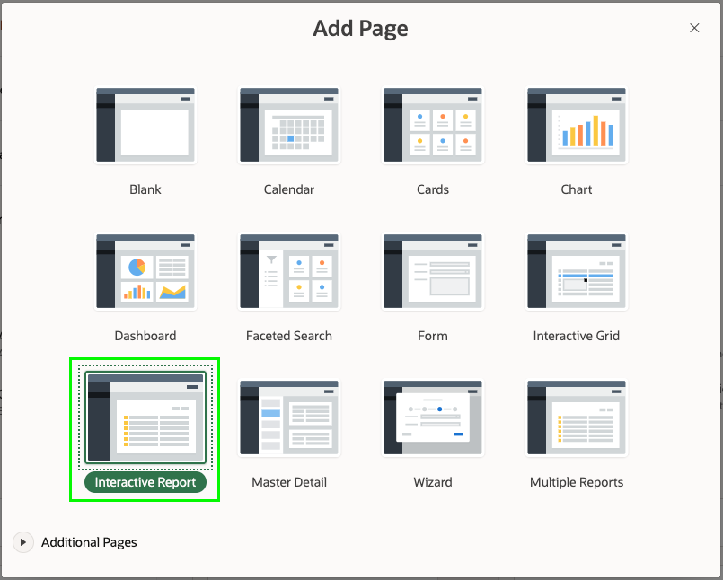

3. Add Report Page에서 아래와 같이 입력하세요.

   - Page Name : **Milestones** 입력
   - Table : **EBA_PROJECT_MILESTONES** 선택
   - **Include Form** 체크
   - Lookup Columns 확장
     - Lookup Key 1 : **PROJECT_ID** 선택
     - Display Col 1 : **EBA_PROJECTS.NAME** 선택
   - **``Add Page``** 버튼을 클릭하세요

   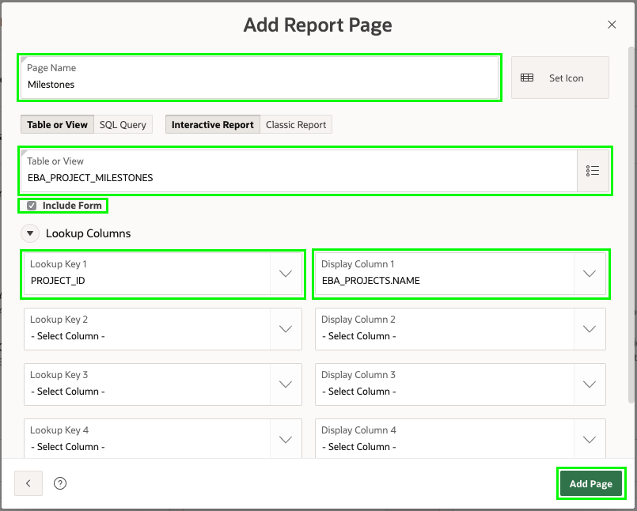

## **파트 7** - Task 페이지 추가하기

**EBA_PROJECT_TASKS** 테이블은 가장 많은 데이터를 조회하고 업데이트하는 주요한 테이블입니다. 따라서 이 표에 Faceted Search 페이지, Report and Form 페이지 및 Calendar 페이지를 추가하세요.

1. Create Application 화면에서 **Add Page** 를 클릭

2. **Faceted Search** 선택

   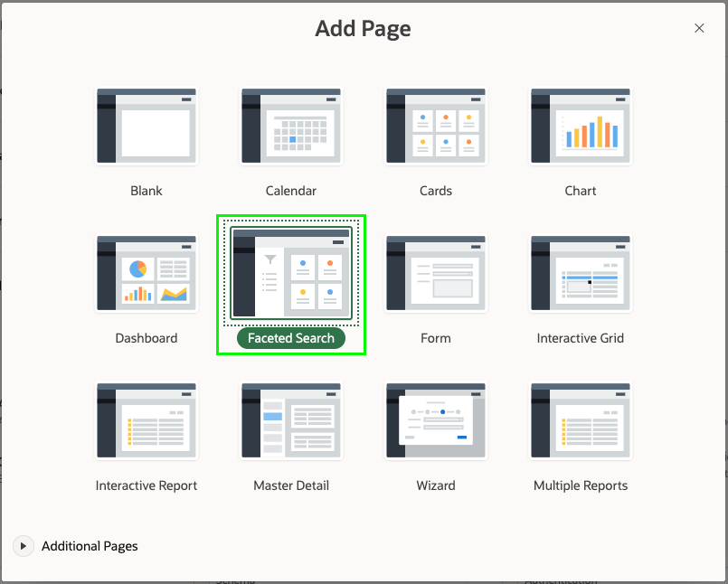

3. Add Faceted Search Page 에서 아래와 같이 입력합니다.

   - Page Name : **Tasks Search** 입력
   - Table : **EBA_PROJECT_TASKS** 선택
   - **``Add Page``** 버튼 클릭

   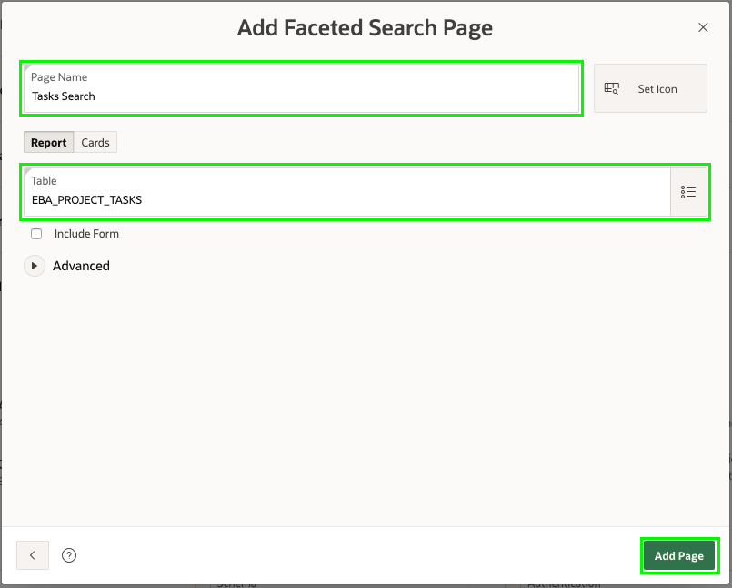

4. **Dashboard** 페이지 아래에 **Tasks Search** 페이지를 올려 놓는 것이 좋습니다.

   **Tasks Search** 의 Edit 버튼 오른쪽에 있는 햄버거 버튼(4줄 평행 막대 모양)을 클릭 한 상태로 **Dashboard** 페이지와 **Projects** 페이지 사이로 드래그 앤 드랍 하세요.

   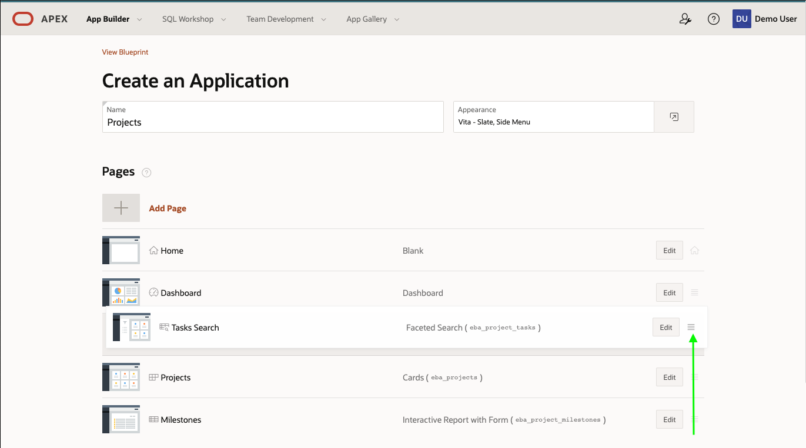

5. 이제 Report and Form 페이지를 추가합니다.

   Create Application 화면에서 **Add Page** 를 클릭하세요.

6. **Interactive Report** 클릭

7. Add Report Page 에서 아래와 같이 입력하세요.

   - Page Name : **Tasks Report** 입력
   - Table : **EBA_PROJECT_TASKS** 선택
   - **Include Form** 체크
   - Lookup Columns 확장
     - Lookup Key 1 : **PROJECT_ID** 선택
     - Display Col 1 : **EBA_PROJECTS.NAME** 선택
     - Lookup Key 2 : **MILESTONE_ID** 선택
     - Display Col 2 : **EBA_PROJECT_MILESTONES.NAME** 선택
   - **``Add Page``** 버튼 클릭

   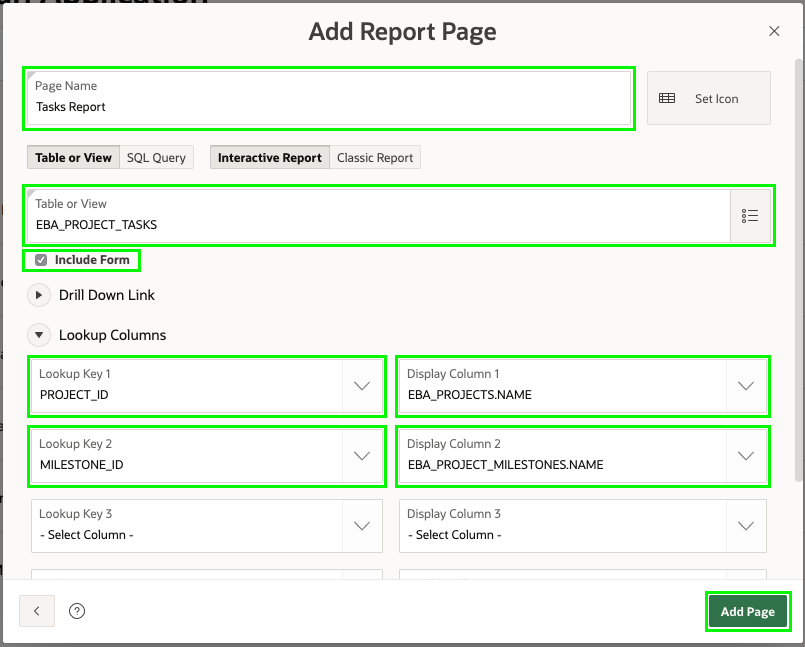

8. 마지막으로 Calendar를 추가합니다.

   Create Application 에서 **Add Page** 를 클릭하세요.

9. **Calendar** 선택

10. Add Calendar Page 에서 아래와 같이 입력하세요.

    - Page Name : **Tasks Calendar** 입력
    - Table : **EBA_PROJECT_TASKS** 선택
    - Display Column : **NAME** 선택
    - Start Date Column : **START_DATE** 선택
    - End Date Column : **END_DATE** 선택
    - **``Add Page``** 버튼 클릭

    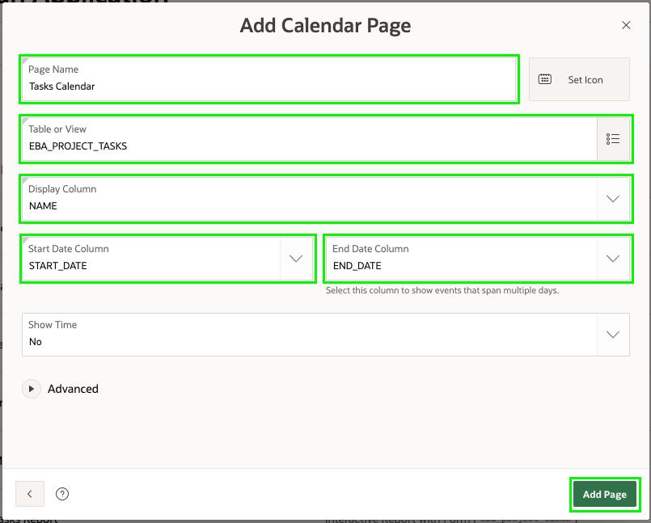

*( 참고 : **SQL Workshop > Object Browser** 로 이동하면, **SAMPLE$PROJECT_TASKS** 테이블을 선택 후 **Create App** 을 클릭하세요. 그러면 Dashboard 페이지, Faceted Search 페이지, Report and Form 페이지 및 Calendar 페이지(해당되는 경우)가 있는 애플리케이션이 생성 됩니다. 이 방법은 특히 어떤 페이지를 첫번째 페이지로 두고 싶은지 결정되지 않았을 때, 애플리케이션을 생성을 시작하기 위한 방법입니다. )*

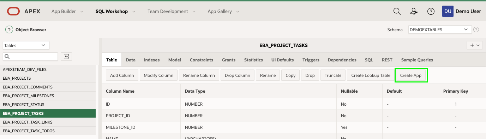

## **파트 8** – 애플리케이션 생성하기

페이지 추가를 완료했고 이제 애플리케이션을 생성하고 리뷰할 시간입니다.

1. 페이지의 아래로 스크롤을 내린 후 **``Create Application``** 버튼을 클릭하세요.

   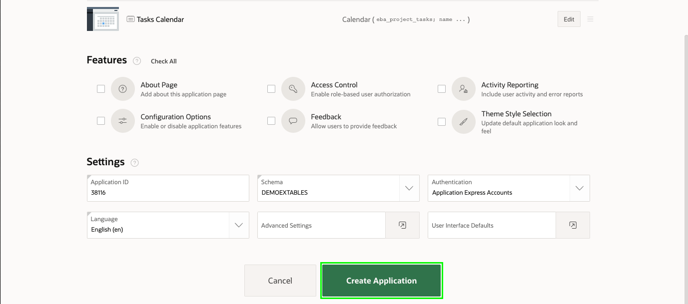

2. 애플리케이션이 생성이 완료되면 신규 애플리케이션이 App Builder 메인화면에 보일것입니다.

   **Run Application** 클릭
   
   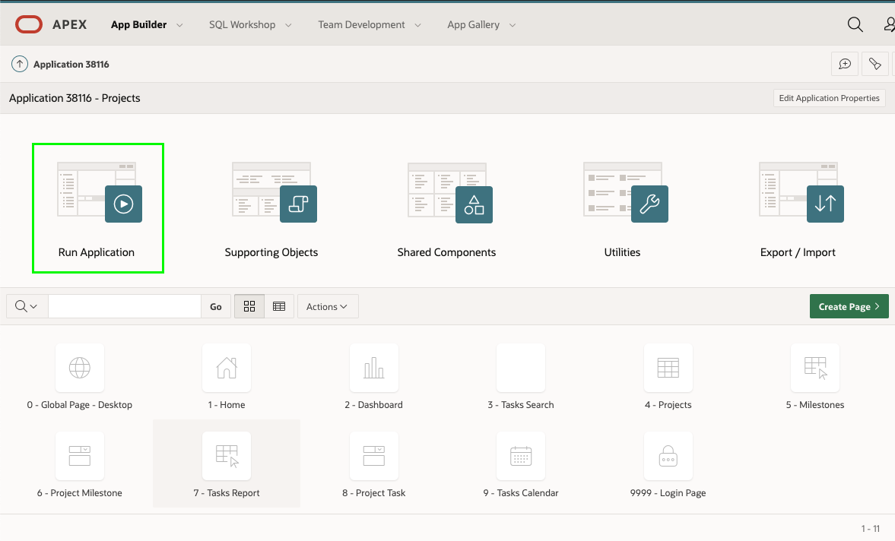

## **파트 9** – 애플리케이션 실행

1. Username 과 패스워드 입력한 후 **``Sign In``** 버튼을 클릭

   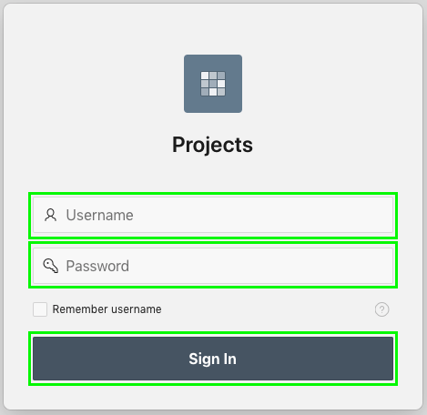

2. 이제 새 애플리케이션을 둘러보세요.

   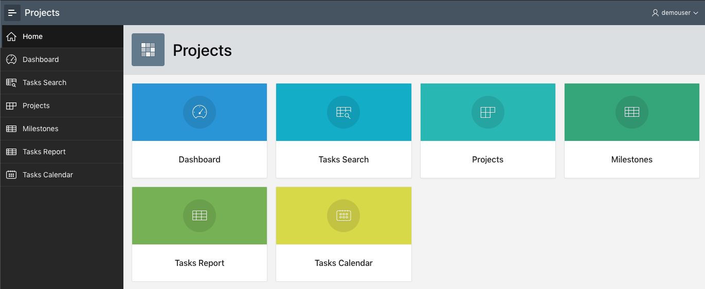

## 요약

모듈 3을 완료했습니다. 여러분은 이제 데이터베이스 Object를 기반으로 다양한 페이지 유형을 사용해서 애플리케이션을 생성하는 방법을 알게 되었습니다. [모듈 4로 이동](Module4.md)하세요.