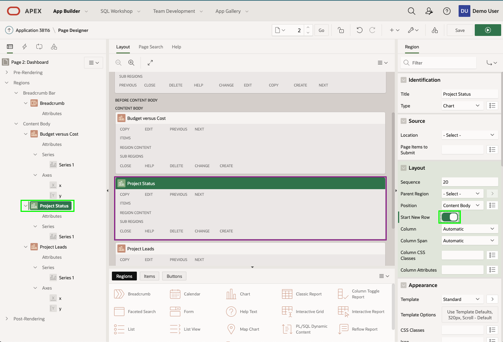
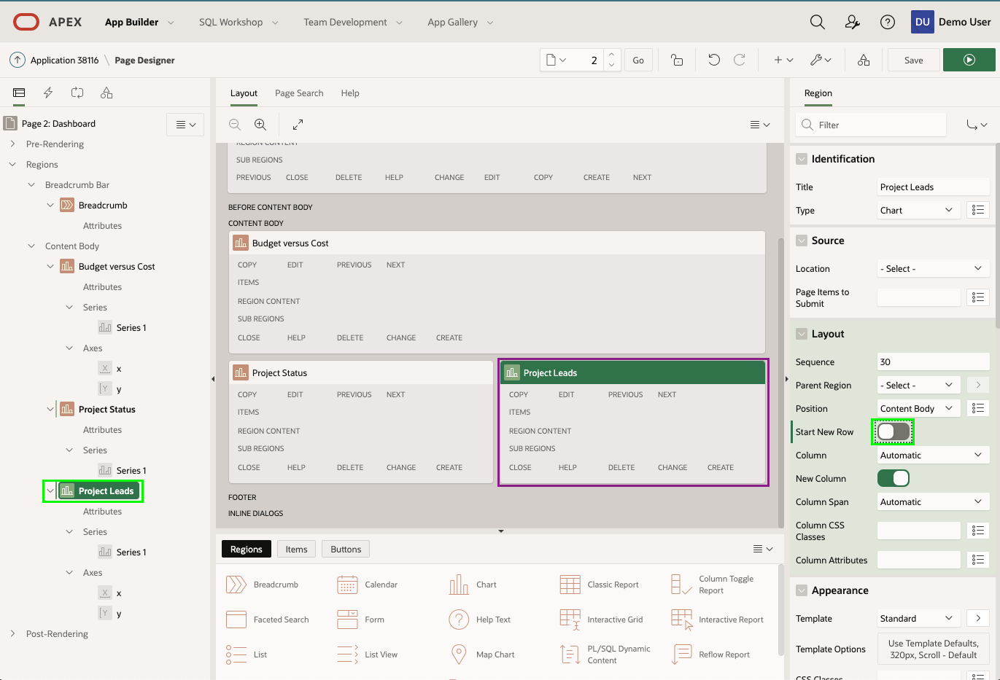

# 모듈 5 : 대시보드 개선

이 모듈에서는 각 영역들을 조작하는 방법을 배우게 됩니다.

## **파트 1** - 차트 4 삭제

대시보드를 보면 데모를 기반으로 한 차트 4가 삭제되어야함을 알 수 있습니다.

1. 애플리케이션 실행 상태에서 **Dashboard** 를 클릭.

2. 개발자 도구에서 (실행 상태에서 화면 하단에 위치) **Edit Page 2** 를 클릭하세요.

   

   현재 화면은 Page Designer 입니다. Page Designer 에서 여러분은 애플리케이션을 개선하기 위해 대부분의 시간을 사용할 것 입니다. Page Designer 에는 3개의 창이 있습니다. 왼쪽창은 Rendering tree와 페이지 컴포넌트 목록을 나타냅니다. 가운데창은 Layout, 페이지 표현 그리고 갤러리가 표시되며 새 컴포넌트를 드래그 앤 드랍을 통해 Layout 에 추가할 수 있습니다. 오른쪽창은 선택한 컴포넌트의 속성을 변경할 수 있는 Property Editor 입니다.

3.  Page Designer 의 Rendering tree (왼쪽창) 에서 **Chart 4** 에서 마우스 오른쪽 버튼 클릭 후 **Delete** 클릭.

   

4. Dashboard 화면을 다시 확인해봅시다.
   Page Designer 툴바에서 **Save and Run** (오른쪽 상단의 ▶ 표시)을 클릭.

   

   해단 페이지가 수정된 레이아웃으로 표시됩니다.

   

## **파트 2** - 영역 이동

수정된 Dashboard 페이지를 보면 Budget versus Cost 차트가 한줄 전체를 다 사용하는 것이 더 좋을것 같습니다.

1. 애플리케이션 실행 상태에서 개발자 도구의 **Edit Page 2** 를 클릭하거나 App Builder 브라우저로 이동 후 직접 Edit Page 2 수정 페이지로 이동합니다.

2. Page Designer 의 Rendering tree (왼쪽창) **Project Status** 를 클릭.
   Property Editor (오른쪽창) 의 Layout > Start New Row 항목 **check**.
   *( 참고  : Layout (가운데창)의 Project Status 영역이 이동됨 )*

   

3. 이제 Project Leads 차트를 Project Status 차트와 같은 라인으로 올립니다.
   Rendering tree (왼쪽창) 에서 **Project Leads** 클릭.
   Property Editor (오른쪽창) 의 Layout > Start New Row 항목 **uncheck**.
   *( 참고 : Layout (가운데창) 의 Project Status 영역이 이동됨 )*

   

4. 이제 Dashboard 페이지를 확인해봅시다.
   **Save and Run** 클릭.

   

## **요약**

모듈 5를 완료했습니다. 이제 여러분은 애플리케이션을 삭제하고 컴포넌트 위치를 변경하는 방법을 배웠습니다. [모듈 6으로 이동](Module6.md)하세요.
