# 모듈 6 : 프로젝트 개선

이 모듈에서는 Create Page 도구를 사용하여 애플리케이션에 페이지를 추가하는 방법에 대해서 배우게 됩니다. 그런 다음 새 페이지를 기존의 Card 페이지에 연결할 것입니다. 그리고 항목이 표시되는 방법을 쉽게 조작할 수 있도록 배우고 마지막으로 Dynamic Anction을 생성하는 방법을 배우게 됩니다.


## **파트 1** - Cards Display 개선

Projects Card 영역을 보면 아이콘이 포함된 카드가 3줄로 되어 있어 데이터를 잘 표현된다는 것을 볼 수 있습니다.  페이지를 개선하기위해 애플리케이션 실행 상태에서 **Live Template Options** 을 직접 사용하세요. 또한 앱 빌더에서 변경할 수 있지만 직접 만든다면 훨씬더 쉽게 결과를 볼 수 있습니다.

1. 런타임 환경에서 **Projects** 클릭.

2. 런타임 페이지 하단의 개발자 도구 모음에서 **Quick Edit** 을 클릭.

   마우스를 Cards 영역 안에 이동하면 파란색 상자가 Cards 영역을 둘러싸고 오른쪽 상단 모서리에 렌치아이콘이 나타나는것을 볼 수 있습니다.

   렌치 아이콘을 클릭.

   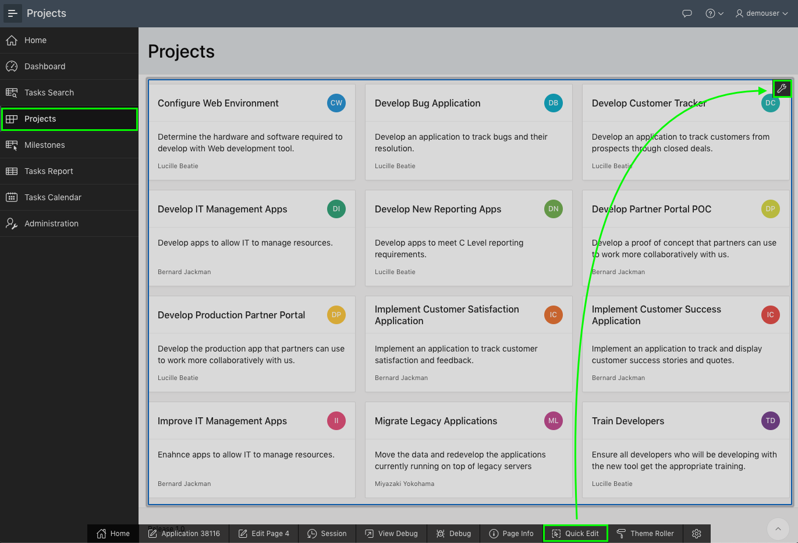

3. Live Template Options 창에서, **Attributes** 를 클릭한 뒤 아래와 같이 입력하세요.

   - Icons : **Display Icons** 선택
   - Layout : **4 columns** 선택
   - **``Save``** 버튼 클릭

   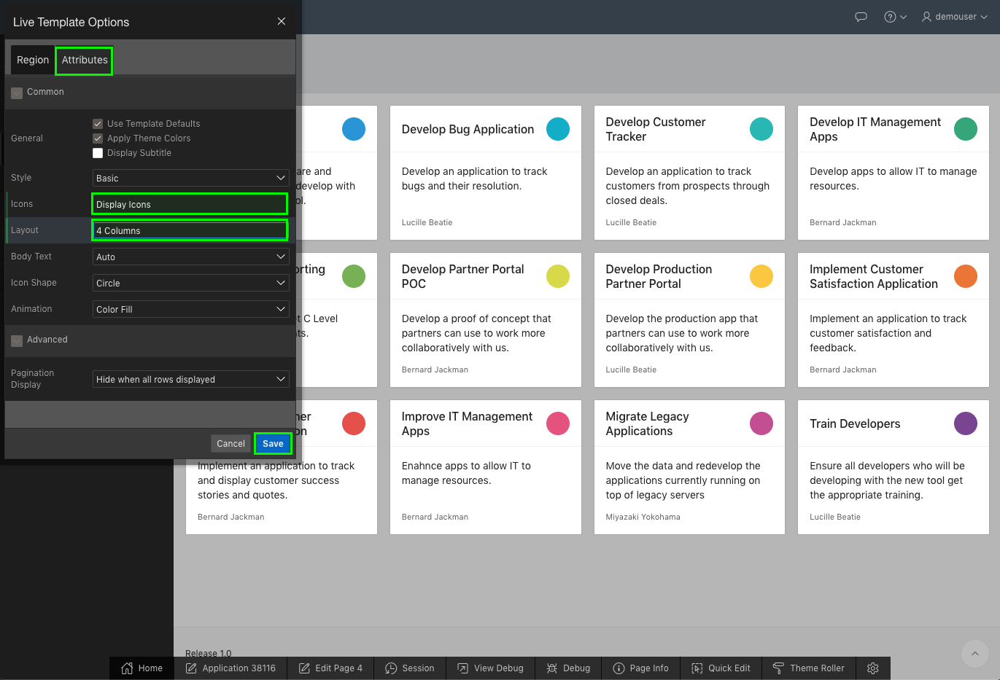


## **파트 2** - Form 페이지 추가

현재 프로젝트 레코드를 관리할 방법이 없습니다. 따라서 **Create Page 도구**를 사용하여 **EBA_PROJECTS** 테이블에 양식 페이지를 작성하십시오.

1. 개발자 도구에서 **Application xxxxx** 를 클릭하거나 App Builder 브라우저 탭으로 다시 이동해 App Builder 의 해당 Application 메뉴로 돌아갑니다.

2. Application 메인 페이지에서 **``Create Page``** 버튼 클릭.

   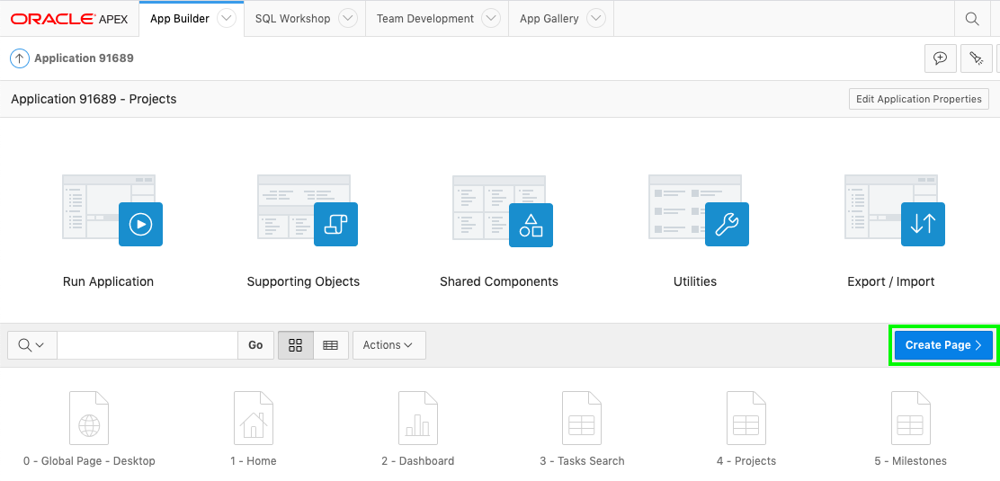

3. Create a Page 다이얼로그에서, **Form** 항목 클릭.

   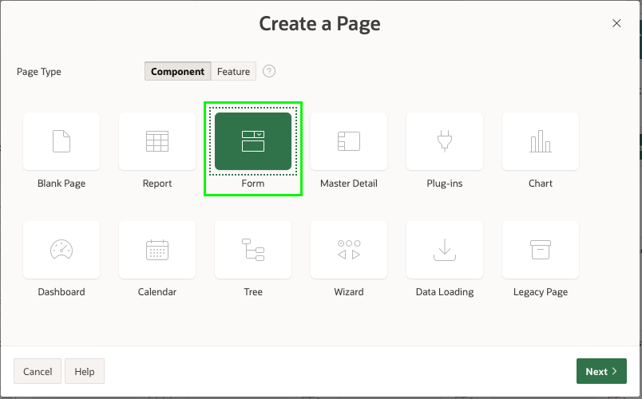

4. Create Page 다이얼로그에서 **Form** 항목 클릭.

   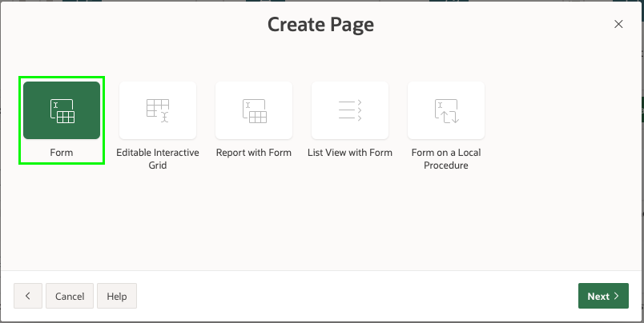

5. Create Form 다이얼로그에서 다음과 같이 입력하세요.

   - Page Name : **Project** 입력
   - Page Mode : **Modal Dialog** 클릭
   - **``Next``** 버튼 클릭

   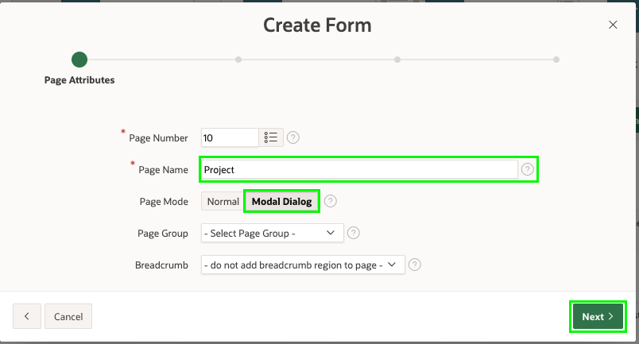

6. Navigation Preference 항목에서 **Identify an existing navigation menu entry for this page** 선택.
   Existing Navigation Menu Entry 항목에서 **Projects** 선택.
   **``Next``** 버튼 클릭.

   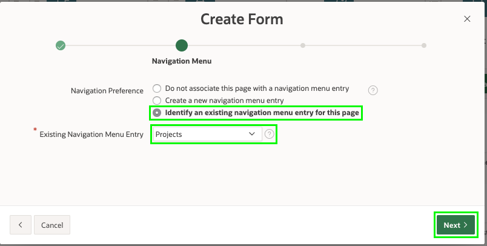

7. Table/ View Name 항목에서 **EBA_PROJECTS (table)** 선택.
   **``Next``** 버튼 클릭.

   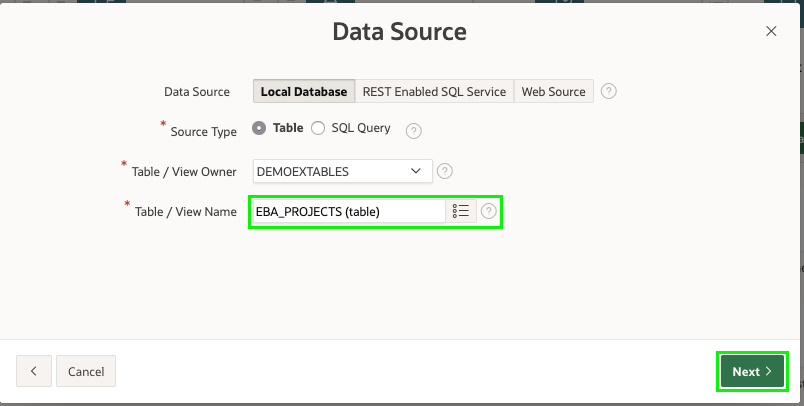

8. Primary Key Column 항목은 **ID (Number)** 선택.
   **``Create``** 버튼 클릭.

   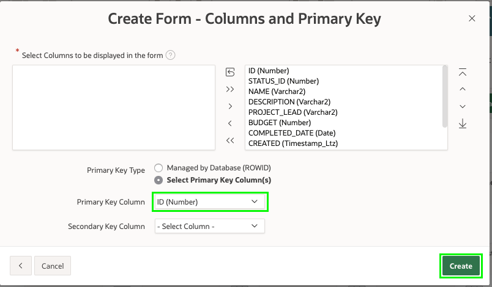

   *( 참고 : 이전 섹션을 제대로 따라한 경우 10페이지 프로젝트가 생성된다. 10페이지가 아닌 경우 섹션 4를 반복하고 마일스톤과 상태 모두에 대한 인터렉티브 그리드가 작성되었는지 확인하십시오. )*


## **파트 3** - Projects 페이지로 연결

이제 이 신규 페이지를 Projects 카드 페이지로 연결합니다.
*( 참고 : Card 영역에 대한 링크를 정의하려면 SQL문 수정이 필요합니다. 그러나 Oracle APEX 의 링크를 정의하는 것은 모듈 8에서 학습한것 처럼 매우 쉽고 선언적입니다. )*

1. Application Toolbar 에서 페이지 번호 10번 앞에 있는 페이지 셀렉터를 클릭하세요.
   Projects 페이지를 위해 **4** 클릭

   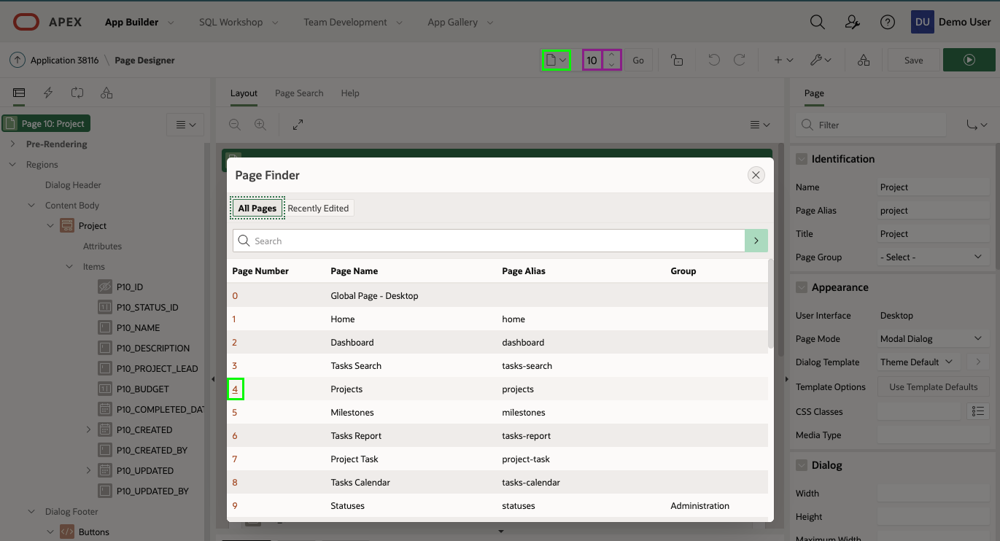

   *( 참고 : 다른 방법으로는 페이지 번호를 입력하거나 위/아래 화살표를 사용하여 페이지 디자이너 내의 다른 페이지로 이동할 수 있습니다. )*

2. Rendering tree (왼쪽창) 에서 **Projects** 선택.
   Property Editor (오른쪽창) 에서 Source > SQL Query 오른쪽에 있는 **Code Editor** 아이콘 클릭.

   CARD_LINK 항목에서 기존 소스를 아래와 같이 변경합니다.

   ```
   apex_util.prepare_url('f?p='||:APP_ID||':10:'||:APP_SESSION||'::::P10_ID:'||id) CARD_LINK, 
   
   ```

   *( 참고 : f?p= 코드는 APEX 페이지를 호출합니다. :APP_ID 는 애플리케이션 ID가 10인 Project 폼 페이지를 의미합니다.  :APP_SESSION 코드는 현재 사용자의 세션값 입니다. P10_ID 코드는 타겟 페이지의 PK 항목 을 의미합니다. id 코드는 Projects 테이블의 Primary Key 입니다. )*

   **``OK``** 버튼 클릭.

   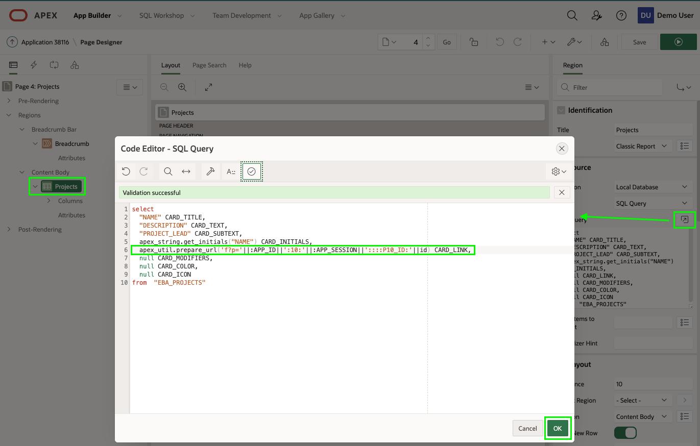

3. 새 Project를 추가도 할 수 있어야 하므로 버튼을 추가하고 Project 페이지에 연결해야 한다. 이것을 추가하는 가장 쉬운 방법은 해당요소를 갤러리에서 레이아웃(중간 창)으로 끌어다 놓는 것이다. 

   중간창의 Layout 에서 **Breadcrumb** 를 클릭해서 해당 영역이 포커스 되도록 합니다.
   Layout 아래에 있는 갤러리에서 **Buttons** 클릭.
   **Text [Hot]** 항목 클릭 후 Breadcrumb 영역으로 드래그 한 뒤 , **Create** 표시 아래로 가져갑니다.
   선택영역이 노란색 영역으로 확장되면 마우스를 놓으면 됩니다.
   

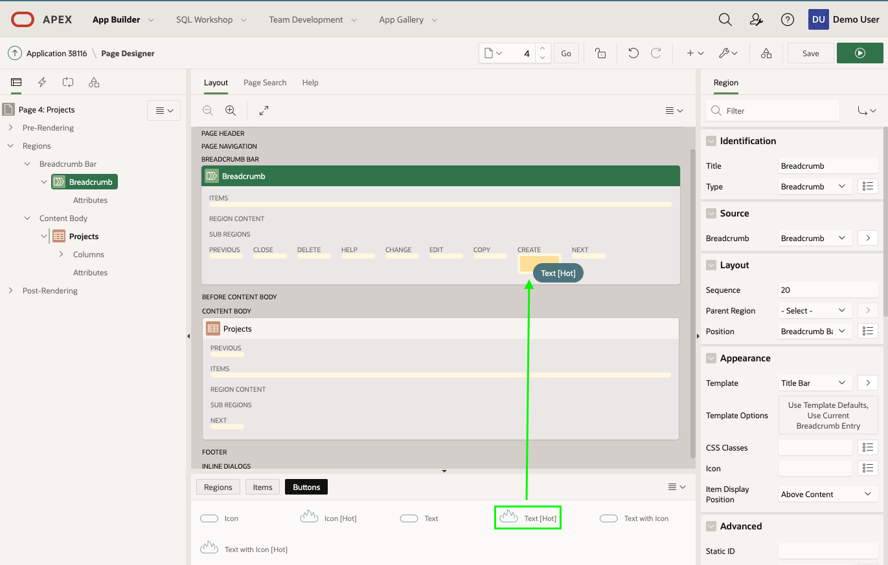

4. 이제 버튼 속성을 업데이트 합니다.
   오른쪽 창의 Property Editor 에서 다음과 같이 입력하세요.

   - Identification > Button Name : **CREATE** 입력
     *( 참고 : Identification > Type 속성은 타이틀을 입력하면 Create 로 업데이트 됩니다. )*
   - Behavior > Action : **Redirect to Page in this Application** 선택
   - Behavior > Target : *No Link Defined* 클릭 후 아래내용입력
     - Target > Page : **10** 입력
     - Clear Session State > Clear Cache : **10** 입력
     - **``Ok``** 버튼 클릭

   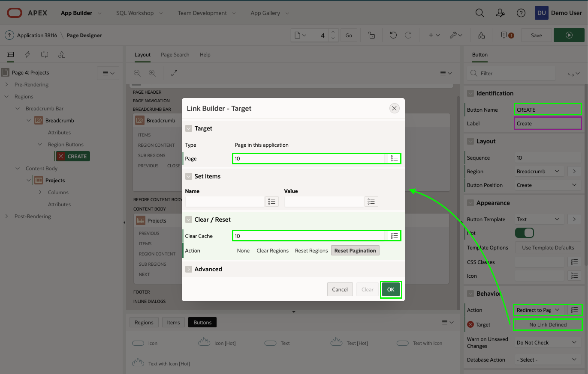

5. 이제 페이지 링크가 동작하는지 테스트 합니다.
   **Save and Run** 클릭.
   Projects 의 Card 또는 **Create** 클릭.

   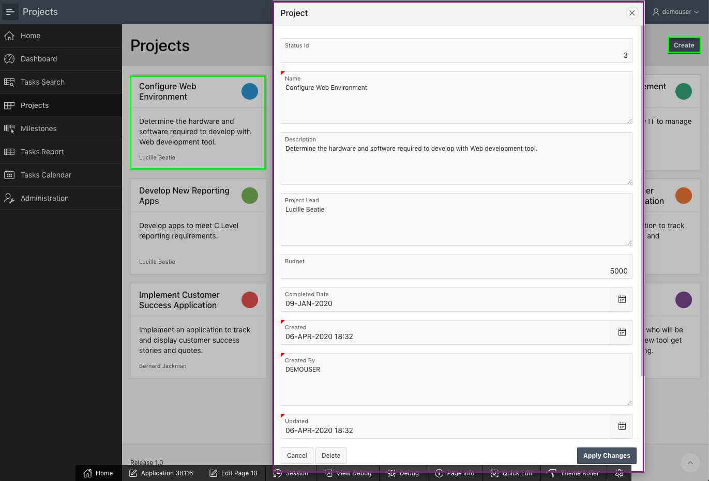


## **파트 4** - 항목 표시 방법 업데이트

Status, Name, Project Lead의 표시 방식을 쉽게 개선할 수 있습니다. 
**STATUS_ID** 항목은 **EBA_PROJECT_STATUS** 테이블의 외래키 입니다. 따라서 사용자가 숫자를 입력하도록 하기보다는 테이블 데이터를 기반으로 값 리스트로 데이터를 입력하도록 합니다.  Name, Project Lead 필드는 Text Field 로 업데이트 해야합니다. 마지막으로 audit 컬럼은 숨겨야 합니다.

1. 먼저 Status 항목을 숫자 항목에서 허용 가능한 값 목록으로 변경하십시오.
   애플리케이션 실행 상태에서 Project 상세 페이지를 띄운 다음 개발자 도구의 **Edit Page 10** 을 클릭하세요.
   또는 App Builder 의 해당 애플리케이션 페이지로 다시 이동한 다음 페이지 10으로 이동하십시오.

2. 페이지 10의 Page Designer Rendering tree (왼쪽창) 에서 **P10_STATUS_ID** 클릭.
   Property Editor (오른쪽창) 에서 다음과 같이 입력하세요.

   - Identification > Type : **Select List** 선택
     *( 참고 : Select List 를 선택하면 항목이 빨간색으로 바뀌고 메시지가 가운데 창에 표시됩니다. 이것은 List of Values 속성을 입력하면  사라집니다. )*
   - Label > Label : **Status** 입력
   - List of Values > Type : **SQL Query** 선택
   - SQL Query 입력:
     `select code d, id r`
     `from eba_project_status`
     `order by display_order`

   *( 참고 : code 컬럼은 사용자에게 표시도는 값이고 id컬럼은 테이블의 컬럼으로 반환되는 값입니다. 테이블에는 상태가 올바른 순서로 표시되기 위해 display_order 컬럼이 표함되어 있습니다. )*

   - Display Extra Values : 클릭해서 **비활성화**
   - Null Display Value : **– Select Status –** 입력
     *( 참고 : 텍스트 입력하는 부분입니다. )*

   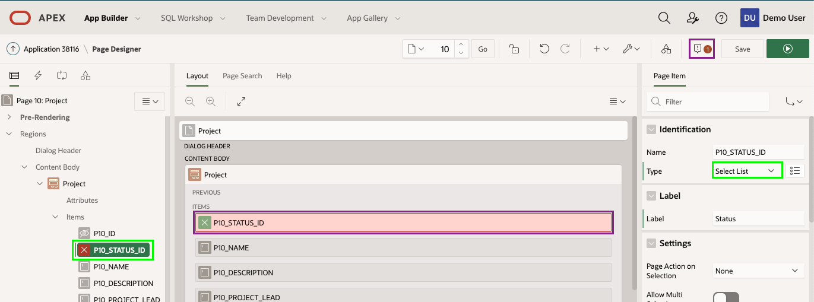

   

   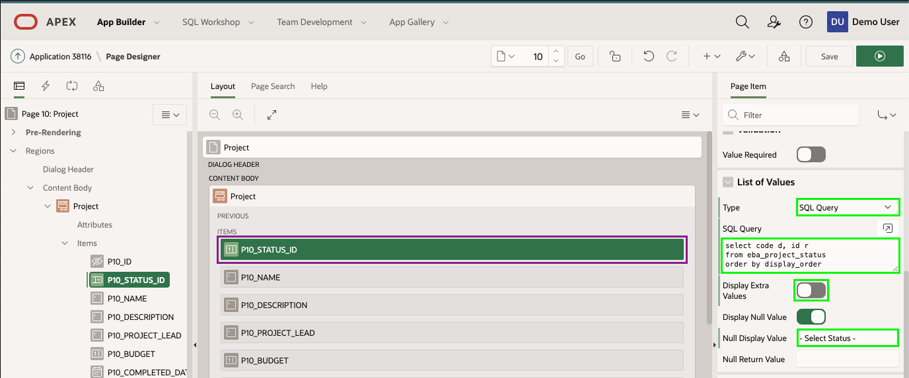

3. 이제 Name, Project Lead 항목을 text field 로 업데이트 합니다.
   Rendering Tree (왼쪽창) 에서 **P10_NAME** 클릭
   Control 키를 누른 상태로 **P10_PROJECT_LEAD** 클릭

   Property Editor (오른쪽창) 의 Identification > Type 을 **Text Field** 으로 선택

   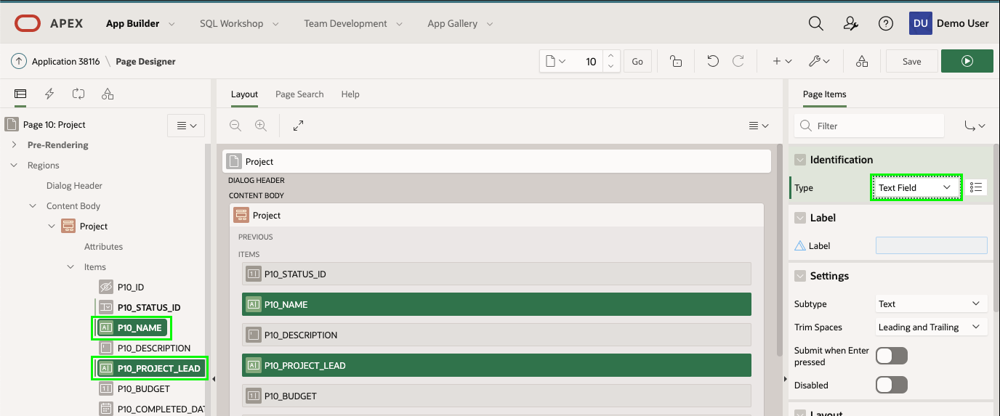

4. 마지막 스텝은 audit 컬럼을 숨기는 것입니다.
   Rendering Tree (왼쪽창) 에서 **P10_CREATED** 클릭
   Shift 키를 누른 상태로 **P10_UPDATED_BY** 클릭

   Property Editor (오른쪽창) 의 Identification > Type 을 **Hidden** 으로 변경

   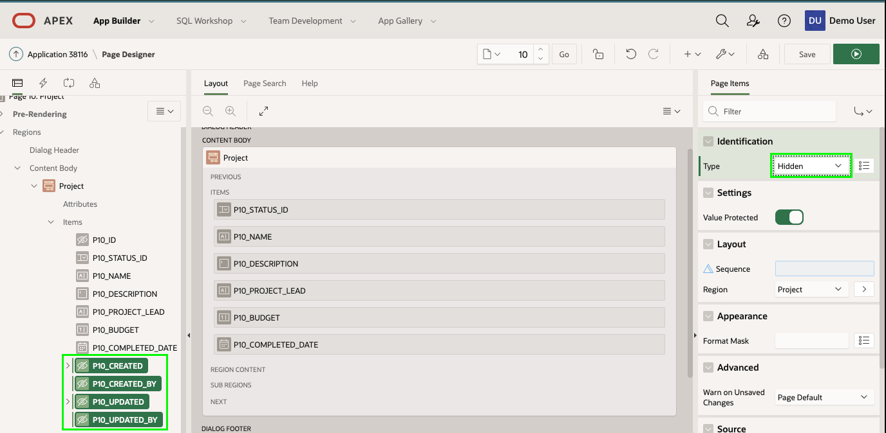


## **파트 5** - Completed Date 입력 개선

현재 Completed Date 를 모든 Project에 입력할 수 있습니다. 그러나 데이터 품질 향상을 위해 Status 항목이 *COMPLETED* 인 날짜만 입력될 수 있도록 할 것입니다. 이러한 기능을 구현하기 위해 Status 값에 따라 Completed Date 항목이 enable / disable 할 수 있는 JavaScript 가 필요합니다. APEX 개발자 입장에서 고맙게도 JavaScript 를 작성할 필요는 없습니다. 트리거, 액션, 영향받는 요소들을 지정하여 client-side에서 반응할 수 있는 Dynamic Action 을 간단히 정의할 수 있습니다. 

1. Status 항목의 트리거 요소에 대한 Dynamic Action 을 정의해야 합니다.
   Rendering Tree (왼쪽창) 의 **P10_STATUS_ID** 에서 마우스 오른쪽 버튼을 클릭합니다.
   **Create Dynamic Action** 를 클릭합니다.

   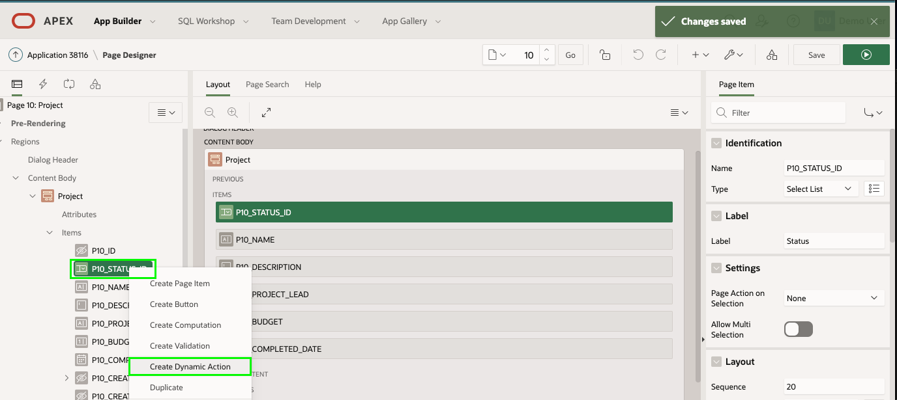

2. Status 값이 *COMPLETED* 인 경우에만 트리거 될 수 있도록 Dynamic Action 을 업데이트 합니다.
   Dynamic Action 의 New 를 선택한 후 Property Editor (오른쪽창) 아래와 같이 입력합니다.

   - Identification > Name : **Enable Completed Date** 입력
   - Client-Side Condition > Type : **Item = Value** 선택
     *( 참고 : Client-Side Condition > Item 은 자동으로 현재 항목인 P10_STATUS_ID 으로 입력됩니다. )*
   - Client-Side Condition > Value : **3** 입력
     *( 참고 : 3 은 Status 값이 COMPLETED 을 의미합니다. }*

   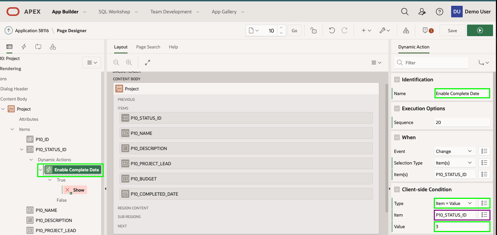

3. 다음은 트리거 이벤트 상태가 true 일 때 어떤일이 발생하는지 지정해야 합니다.
   Rendering tree (왼쪽창) 에서 현재 보여지고 있는 **True** 의 액션인  **Show**을 클릭
   Property Editor (오른쪽창) 에서 다음과 같이 입력

   - Identification > Action : **Enable** 선택
   - Affected Elements > Item(s) : **P10_COMPLETED_DATE** 선택

   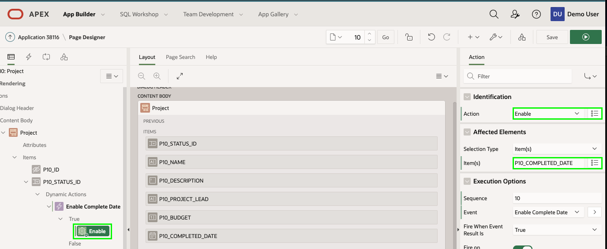

4. 마지막으로 트리거 이벤트 상태가 false 일때 Completed Date 항목을 *disable* 하는것도 중요합니다.
   Rendering tree (왼쪽창) 의 Dynamic Actions 항목의 **Enable** 에서 마우스 오른쪽버튼 클릭.
   **Create Opposite Action** 클릭.

   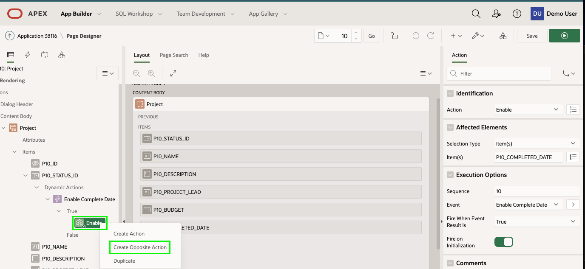

5. Completed Date 를 페이지 아래에 표시하는것 보다 Status 항목 다음에 바로 표시되는 것이 훨씬 좋습니다.
   Rendering tree (왼쪽창) 에서 **P10_COMPLETED_DATE** 클릭.
   Property Editor (오른쪽창) 에서 다음과 같이 입력

   - Layout > Sequence : **25** 입력
     *( 참고 : P10_STATUS_ID 항목과 P10_NAME 항목 사이에 위치합니다. )*
   - Layout > Start New Row : ***Uncheck***
     *( 참고 : P10_STATUS_ID 항목과 동일한 라인에 위치합니다. )*

   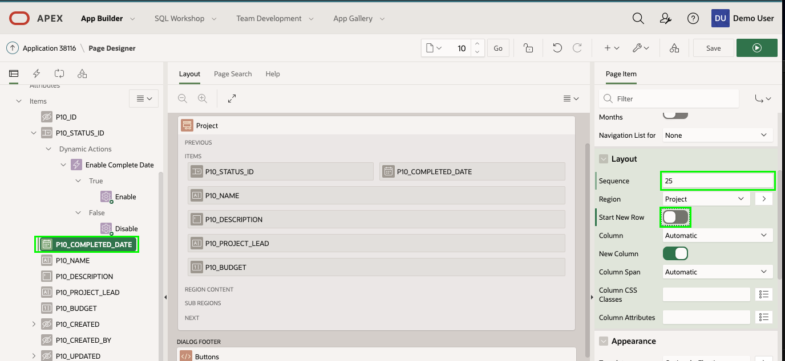

6. 이제 Project form 페이지를 확인해봅니다.
   **Save** 클릭.
   *( 참고 : 만약 Save and Run 을 클릭하면 변경사항은 저장되지만 페이지는 실행되지 않습니다. 이것은 모달 페이지라서 페이지 디자이너에서 바로 실행될 수 없고 페이지에서 호출되어야 합니다. )*

7. 애플리케이션 실행 상태로 돌아갑니다. 브라우저를 새로고침 한 후 왼쪽에 위치한 메뉴에서 **Projects** 클릭.
   카드 레코드를 클릭해서 해당 레코드의 상세화면을 봅니다.
   Status 항목을 변경 한 후 Completed Date 항목이 바르게 enabled 또는 disabled 되는지 확인합니다.
   변경 후 **``Apply Changes``** 버튼 클릭 또는 **``Cancel``** 버튼을 클릭.

   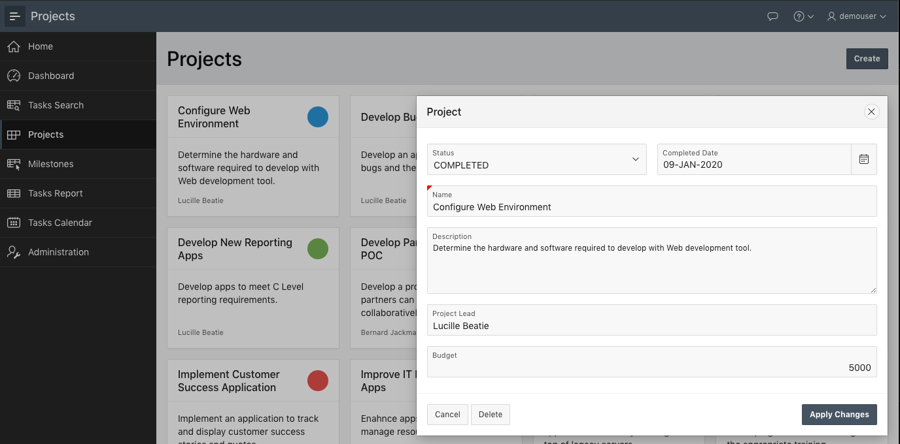


## **요약**

모듈 6을 완료했습니다. 이제 여러분은 애플리케이션에 부가적인 페이지를 추가하는 방법, 페이지 링크, 항목들을 디스플레이 하는 방법, client-side 동적페이지를 정의하는 방법을 알게 되었습니다. [모듈 7로 이동](Module7.md)하세요.
