# 모듈 7 : 마일스톤 개선

이 모듈에서는 Interactive Grid 의 레이아웃을 업데이트 하는 방법을 배우게 됩니다.

## **파트 1** - Name Column 변경

애플리케이션을 실행하고 **Milestones** 을 클릭한 다음 레코드를 더블클릭하면 상세내용을 수정할 수 있습니다. 각 컬럼으로 이동하여 Project 컬럼은 select list로 되어있고, Name 과 Description 컬럼은 textarea 그리고 Due Date 컬럼은 date picker 입니다. 일반적으로 Name 항목은 그리 길지 않으므로 컬럼 유형을 text 필드로 업데이트 해야 합니다.

1. App Builder 로 이동합니다.

2. 해당 애플리케이션의 Page Designer 에서 페이지 5 로 이동합니다.

3. Rendering tree (왼쪽창) 에서 **Project Milestones** 영역 아래의 **Columns** 항목을 펼칩니다.
   컬럼 리스트 중에 **Name** 을 클릭하세요.
   Property Editor (오른쪽창) 의 Identification > Type 에서 **Text Field** 를 선택하세요.

   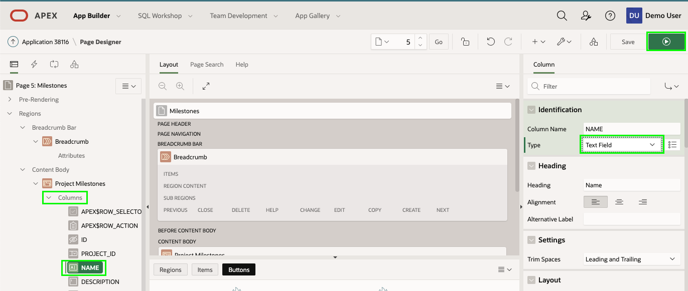

4. 애플리케이션 툴바에서 **Save and Run** 을 클릭합니다.
   Name 컬럼의 레코드를 더블클릭 합니다.

   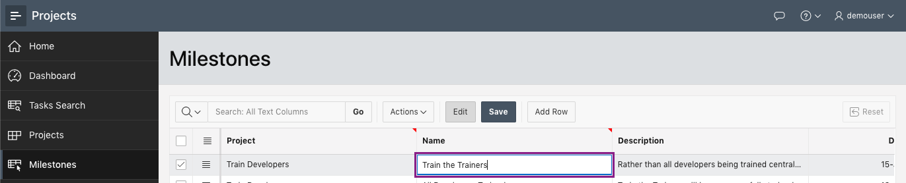

## **파트 2** - Grid Layout 업데이트

레포트를 다시 한번 리뷰해보니 컬럼을  Name, Project, Due Date, Description 순서로 다시 정렬하는 것이 좋을 것 같습니다. 사용자가 오른쪽으로 스크롤 해서 더 많은 컬럼들을 볼 수 있으니 Name 컬럼을 고정하는 것도 유용해 보입니다.

1. 애플리케이션 실행 상태에서 **Actions** 을 클릭한 다음 **Columns** 을 클릭합니다.

   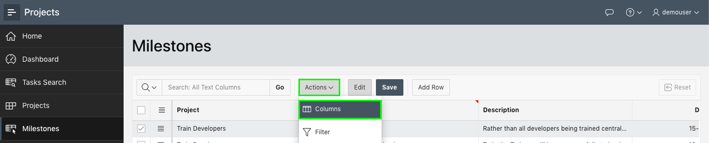

2. Columns 다이얼로그에서 **Name** 을 클릭한 후 위쪽 화살표를 클릭해서 **Projects** 이전으로 이동합니다.
   **``Save``** 버튼 클릭.

   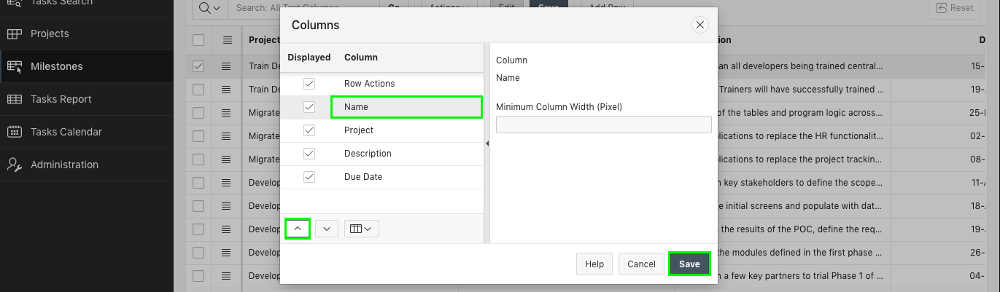

3. 드래그 앤 드랍을 사용해서 컬럼들을 재정렬 할 수도 있습니다.
   마우스커서가 이동표시로 바뀔때까지 **Due Date** 컬럼의 시작부분 근처에서 마우스를 움직여 보세요.
   마우스를 클릭한 상태로 **Description** 컬럼 이전에 위치할때 까지 드래그 한 뒤 드랍하세요.
   
   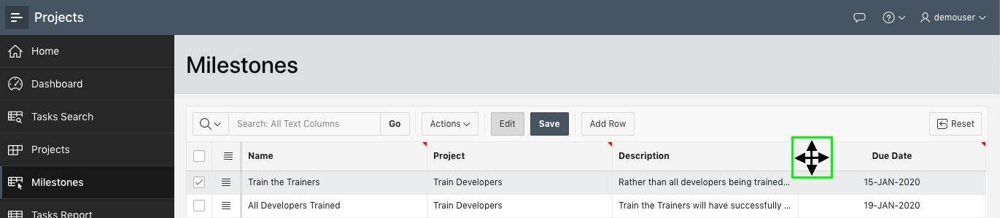
   
   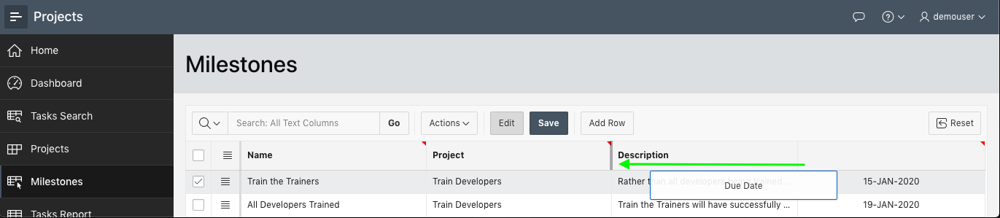

4. 왼쪽 메뉴를 닫으면 그리드를 더 편하게 볼 수 있습니다.
   애플리케이션 이름 앞에 있는 아이콘을 클릭하세요.

   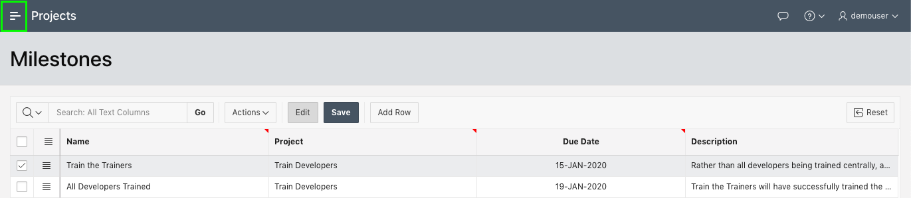

5. 이제 컬럼들은 올바르게 정렬되어 있고 Name 컬럼을 고정시켜야 합니다.
   **Name** 컬럼 헤더를 클릭. **Freeze** 버튼 클릭.
   
   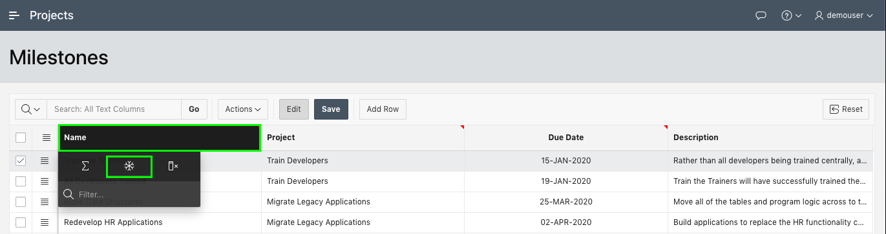

6. 이제 데이터를 더 잘 표시하기 위해 컬럼 크기 조절이 필요합니다.
   사이즈 조절 커서로 변경될때 까지 **Name** 과 **Project** 컬럼 사이를 마우스를 움직입니다.
   **Name** 컬럼 사이즈가 적절할때 까지 컬럼 구분자를 오른쪽으로 드래그 합니다.
   Project, Due Date 컬럼에 대해서도 동일하게 수행합니다.
   *( 참고 : 마지막 컬럼인 Description 컬럼의 사이즈도 동일한 방법을 사용해서 조절할 수 있습니다. )*

   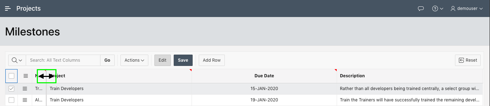

   

   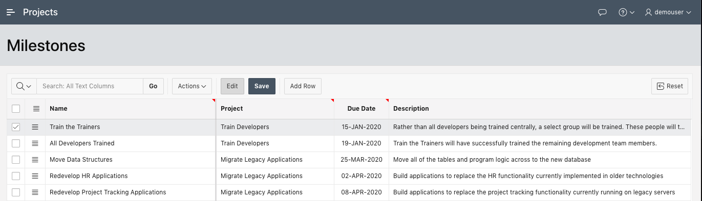

7. 디스플레이 고정기능을 테스트 하기위해 왼쪽 메뉴 부분을 다시 활성화합니다.
   애플리케이션 이름 앞의 아이콘을 클릭하세요.

   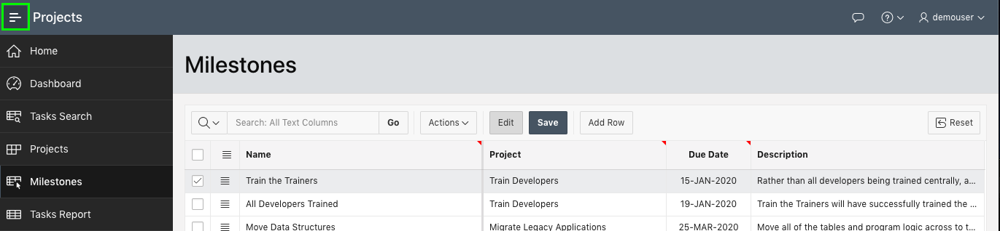

## **파트 3** - Report 저장

Grid 레이아웃에 대해 변경한 내용은 개인적인 Grid 뷰 입니다. 만약 다른 사용자들이 로그인 한다면 그들은 원래의 레이아웃을 볼 것입니다. 따라서 디폴트 레포트 레이아웃을 저장해야 합니다.

1. 애플리케이션 실행해서 Milestones 메뉴에서 **Actions** 클릭 후 **Report** 를 선택한 다음 **Save** 를 선택.
   *( 참고 : 앱 빌더에서 애플리케이션을 실행한 개발자만 디폴트 레포트를 "Save" 할 수 있습니다. 일반사용자는 오직 "Save As" 만 사용할 수 있습니다. )*

   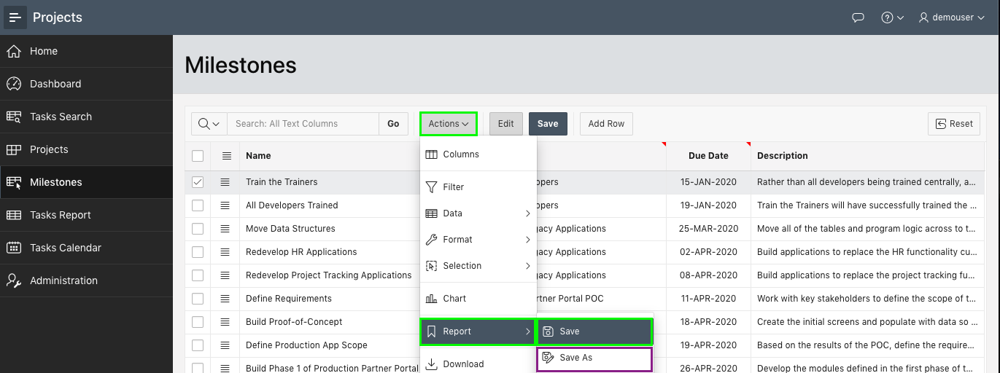

## 요약

모듈 7을 완료했습니다. 이제 여러분은 Interactive Grid를 조작하고 default 포맷를 저장하는 방법을 배웠습니다.[모듈 8로 이동](Module8.md)하세요.
