# 모듈 8 : Tasks 개선

이 모듈에서는 공유된 값 리스트를 정의하고 이를 사용해서 Faceted Searches 그리고 Task 를 위한 Interactive Report 페이지를 개선하는 방법을 배우게 됩니다. 또한 Task Form 페이지에서 캘린더로 연결하는 것이 얼마나 쉬운지 배우게 될 것입니다.

## 파트 1 - 공유된 값 리스트 정의하기

애플리케이션 실행 상태에서 Tasks Search 메뉴를 클릭해 페이지를 살펴보세요. Is Complete 컬럼의 데이터가 "Y" 를 표시되는 것에 주목해봅니다. 이제 Task Report 로 이동해 봅니다. 여기에도 동일한 문제가 발견됩니다. 이 항목을 "Yes" 또는 "No" 를 표시하는 것이 훨씬 좋을 것 같습니다.  이는 List of Values (LOV)를 정의하면 쉽게 적용할 수 있습니다.

페이지에서 직접 LOV 를 정의할 수 있습니다. 그러나 여기서 처럼 여러 페이지에 동일한 LOV가 필요한 경우에는 Shared Component 로 한번 정의하는 것이 훨씬 좋습니다.

1. App Builder 의 해당 Application 메인화면으로 이동합니다.

2. 애플리케이션 메인화면에서 **Shared Components** 를 클릭하세요.

   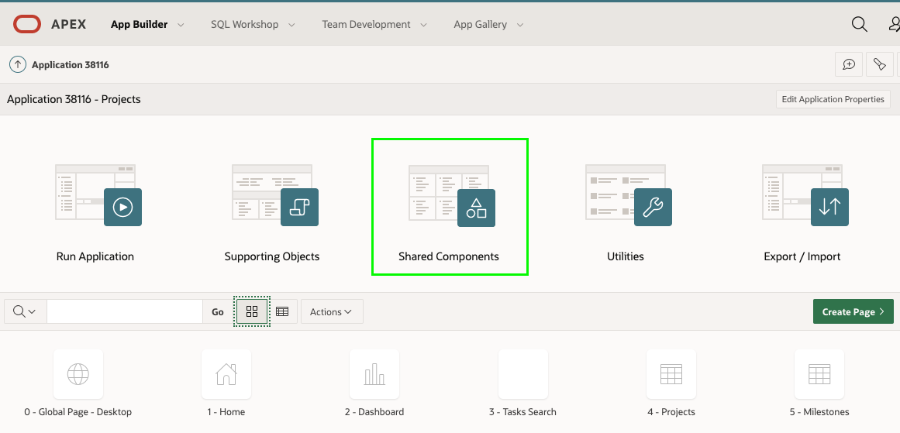

   또는 Page Designer 의 도구모음에서 Shared Components 아이콘을 클릭하는 하세요.

   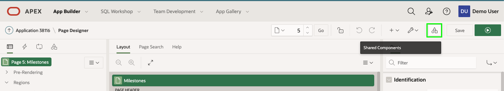

3. Shared Components 에서 **List of Values** 를 클릭하세요.

   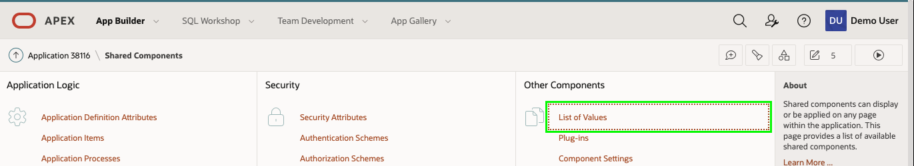

4. 거기에는 이미 몇개의 LOV 리스트가 존재하는 것을 보게 될 것입니다.
   새 LOV 를 생성하기 위해 **``Create``** 버튼을 클릭하세요.

   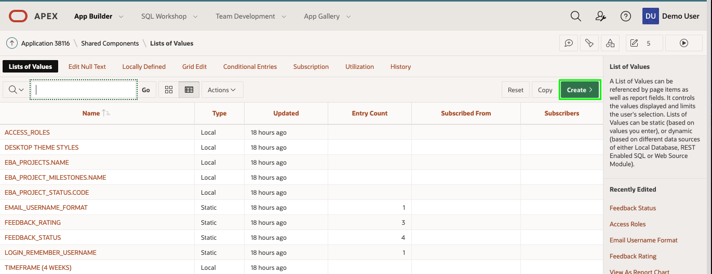

5. Create List of Values 다이얼로그에서 소스에 대한 default 선택항목을 그대로 둡니다. ("From Scratch")
   **Next** 클릭

6. Name, Type 다이얼로그에서 다음과 같이 입력하세요.

   - Name : **YES_NO** 입력
   - Type : **Static** 선택
   - **Next** 클릭

   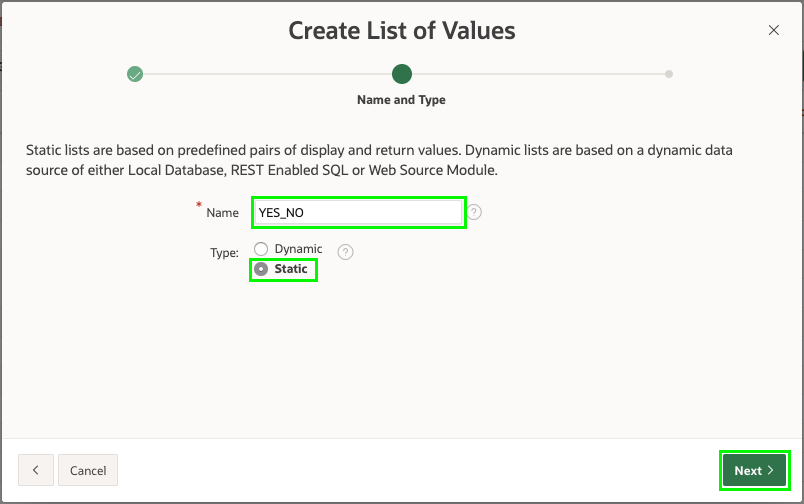

7. Static Values 다이얼로그에서 다음과 같이 입력하세요.

   - Sequence 1
     - Display Value : **Yes** 입력
     - Return Value : **Y** 입력
   - Sequence 2
     - Display Value : **No** 입력
     - Return Value : **N** 입력
   - **Create List of Values** 버튼을 클릭하세요.

   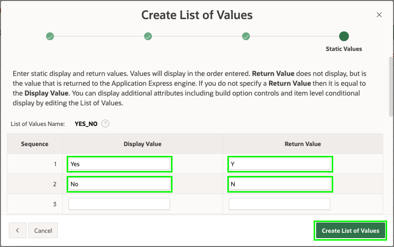

## 파트 2 - 측면 검색바 업데이트

이제 shared component 를 정의했으므로 Faceted Search 페이지에서 이를 활용하세요.

1. 상단의 현재위치 표시항목에서 **Application xxxxx** 클릭

   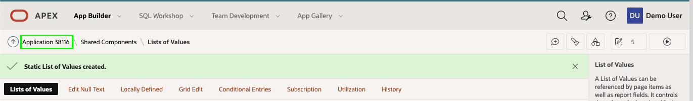

2. 애플리케이션 메인화면에서 **3 - Tasks Search** 클릭

   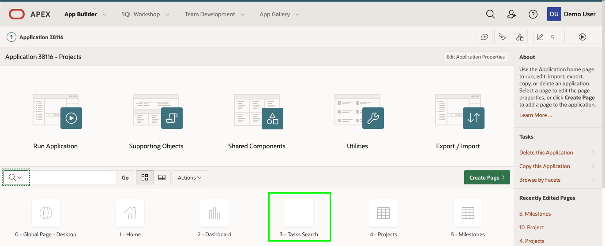

3. 먼저 검색 항목들을 업데이트 하세요.
   Page Designer 내 Rendering tree (왼쪽창) 의 Search 아래에 있는 **P3_IS_COMPLETE_YN** 를 클릭.
   Page Editor (오른쪽창) 에서 다음과 같이 입력하세요.

   - List of Values > Type : **Shared Component** 선택
   - List of Values > List of Values : **YES_NO** 선택

   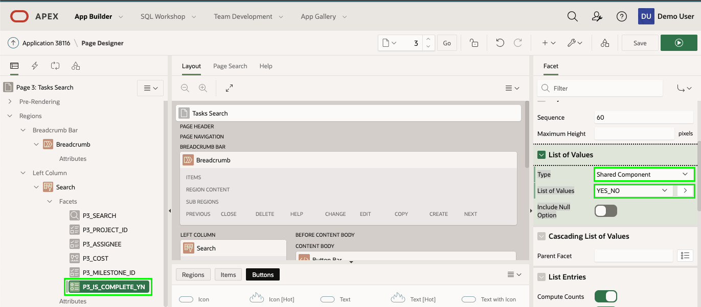

4. 다음으로 레포트에 표시된 값도 업데이트 합니다.
   Rendering tree (왼쪽창) 의 **Project Tasks** 아래의 **Columns** 을 펼칩니다.
   컬럼 목록에서 **IS_COMPLETE_YN** 클릭.
   Property Editor (오른쪽창) 에서 다음과 같이 입력

   - Identification > Type : **Plain Text (based on List of Values)** 선택
   - List of Values > Type : **Shared Component** 선택
   - List of Values > List of Values : **YES_NO** 선택

   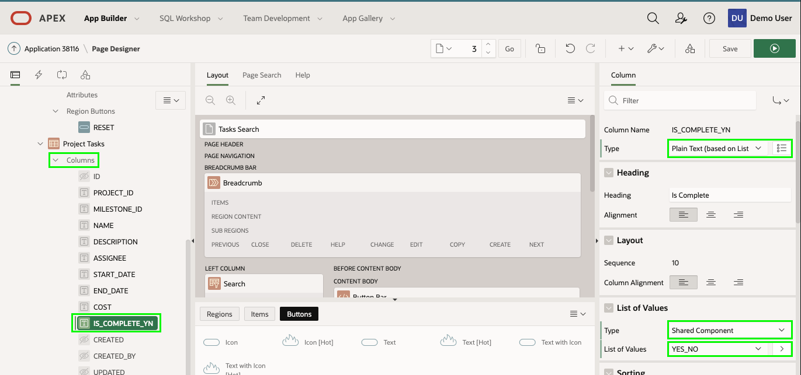

5. 레포트에는 많은 컬럼이 있습니다. Description 컬럼은 너무 많은 공간을 차지하므로 숨겨야 합니다.
   Rendering tree (왼쪽창) 의 **Project Tasks** 아래 컬럼 목록에 있는 **DESCRIPTION** 클릭.
   Property Editor (오른쪽창) Identification > Type 항목에서 **Hidden Column** 선택.

   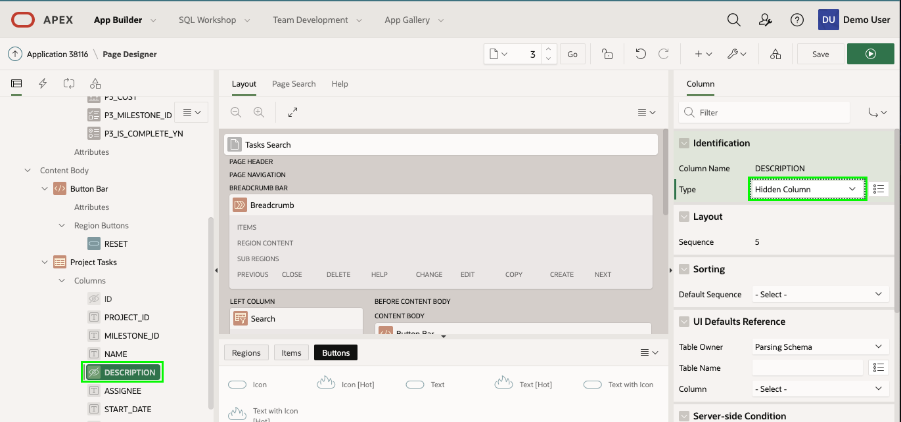

6. 페이지에서 Search 컬럼의 순서를 변경할 수 있습니다.
   Rendering tree (왼쪽창) 에서 **P3_MILESTONE_ID** 클릭
   Property Editor (오른쪽창) 의 Layout > Sequence 항목에서 **25** 입력
   *( 참고 : Projects 컬럼 다음에 Milestones 컬럼 배치 )*

   Rendering tree (왼쪽창) 에서 **P3_IS_COMPLETE_YN** 클릭
   Property Editor (오른쪽창) 의 Layout > Sequence 항목에서 **35** 입력
   *( 참고 : Assignee 컬럼 다음에 Complete 컬럼 배치 )*

   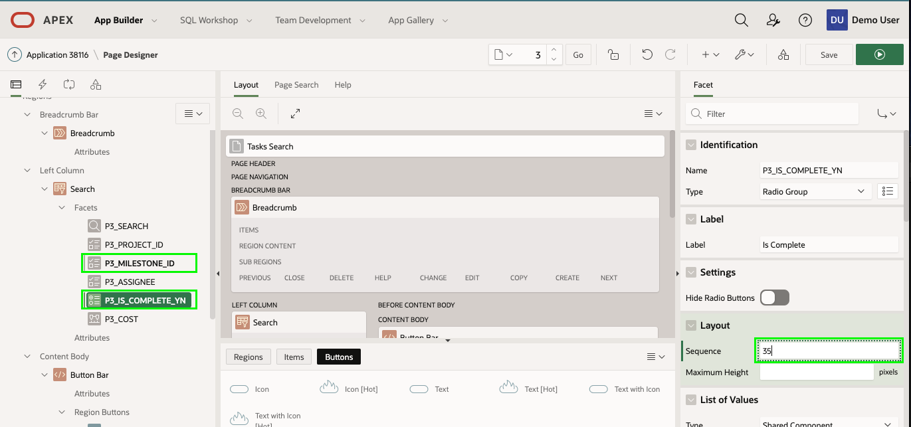

7. 측면 검색창이 완료된 것을 확인해봅시다.
   Page Designer 오른쪽 상단의 **Save and Run** 클릭.

   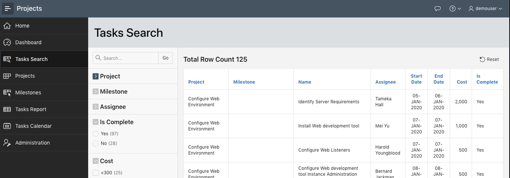

## 파트 3 - Interactive Report 업데이트

Tasks Report 또한 Complete 컬럼을 업데이트해야 합니다.

1. 애플리케이션의 메뉴에서 **Tasks Report** 클릭.
   개발자 도구(화면 하단) 에서 **Edit Page 6** 클릭.
   *( 참고 : App Builder 탭으로 돌아가면 수동으로 페이지 6으로 갈 수도 있습니다. )*

2. Page Designer 에서 **Page 6: Tasks Report** 를 선택
   
   Rendering tree (왼쪽창) 의 **Project Tasks** 영역 아래의 **Columns** 항목을 펼칩니다.
컬럼 목록에서 **IS_COMPLETE_YN** 클릭.
   Property Editor (오른쪽창) 에서 다음과 같이 입력 :
   
   - Identification > Type : **Plain Text (based on List of Values)** 선택
   - List of Values > List of Values : **YES_NO** 선택
   
   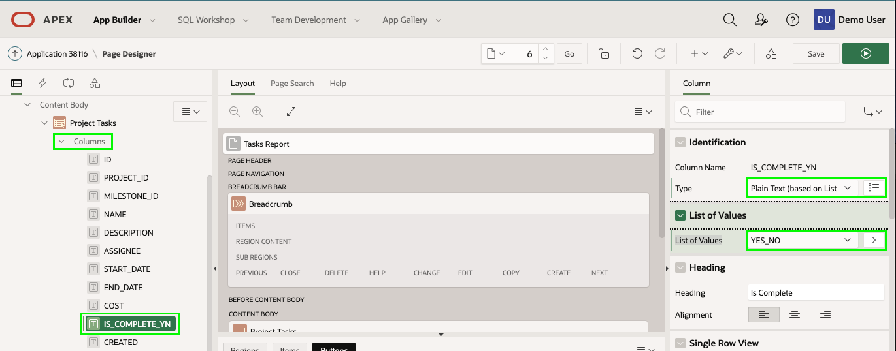
3. 애플리케이션 실행.
   Page Designer 툴바에서 **Save and Run** 클릭.

   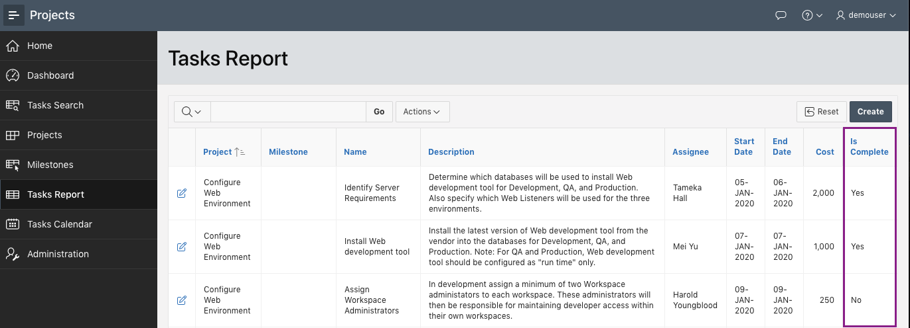

4. 레코드의 수정 아이콘 클릭.
   Is Complete 컬럼은 Switch 를 사용하므로 폼 화면을 수정할 필요가 없습니다.
   *( 참고 : 상세 화면은 7 페이지로 다음 파트에서 필요할 것 입니다. )*

## 파트 4 - Calendar 연결

Tasks Calendar 페이지는 수많은 Task들을 보여줍니다. 그러나 여기서 그 Task 데이터를 바로 수정할 방법은 없습니다. 따라서 페이지에서 Project Task 페이지로 링크를 추가 해야합니다.

1. 애플리케이션의 왼쪽 메뉴에서 **Tasks Calendar** 클릭

2. 이벤트 세부 정보를 간단히 표시하려면 아무 항목이나 클릭하세요.

   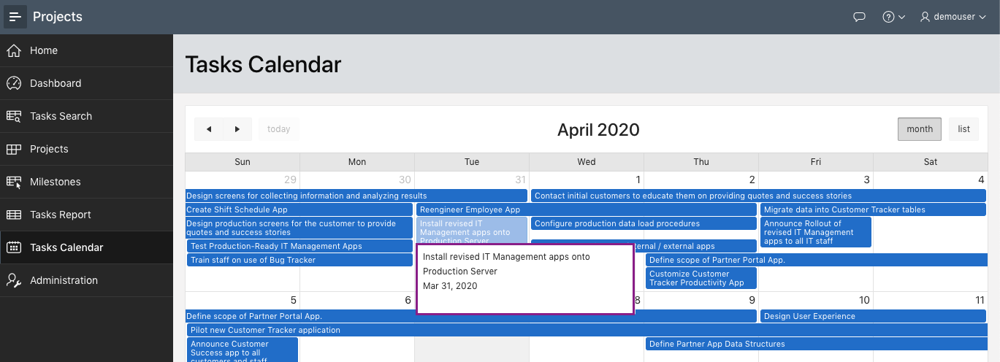

3. 개발자도구 (화면 하단) 에서 **Edit Page 8** 클릭

4. Page Designer 의 Rendering tree (왼쪽창) 에서 **Tasks Calendar** 영역 아래에 있는 **Attributes** 클릭.
   Property Editor (오른쪽창) 의 Settings > View / Edit Link 에서 **No Link Defined** 클릭.
   Link Builder 다이얼로그에서 다음과 같이 입력 :

   - Type : Page in this application 선택
   - Target > Page : **7** 선택
   - Set Items > Name : **P7_ID** 선택
   - Set Items > Value : **ID** 선택 ( **&ID** 입력됨 )
   - Clear Cache : **7** 입력
   - **OK** 클릭
   
   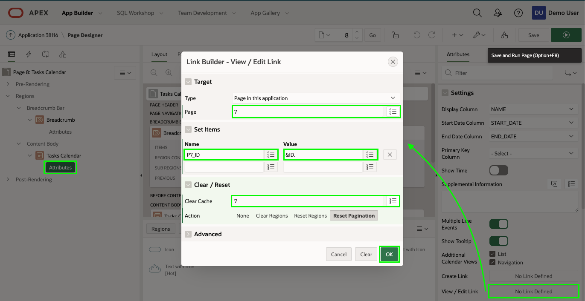
5. 달력에서 호출된 Project Task 양식 페이지에서 Task Name, Start Date 또는 End Date 가 업데이트되면 달력도 업데이트 되는 것이 중요합니다.
   Rendering tree (왼쪽창) 에서 **Tasks Calendar** 마우스 오른쪽 버튼 클릭.
   **Create Dynamic Actions** 클릭.

   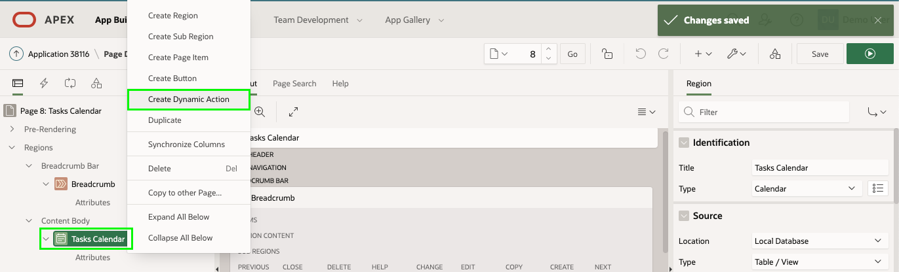

6. Dynamic Actions 선택 후 Property Editor (오른쪽창) 에서 다음과 같이 입력하세요.

   - Identification > Name : **Refresh Calendar** 입력
   - When > Event : **Dialog Closed** 선택
     *( 참고 : Dialog Closed 이벤트는 Project Task 양식  모달 페이지가 클로즈 될 때 호출됩니다. )*

   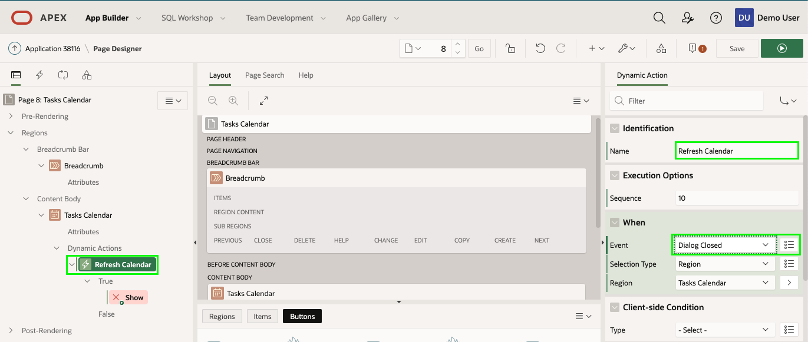

7. Rendering tree (왼쪽창) 의 True action 아래에 있는 **Show** 클릭.
   Property Editor (오른쪽창) 에서 다음과 같이 입력 :

   - Identification > Action : **Refresh** 선택
   - Affected Elements > Selection Type : **Region** 선택
   - Affected Elements > Region : **Tasks Calendar** 선택

   오른쪽 상단의 **``Save``** 버튼클릭.

   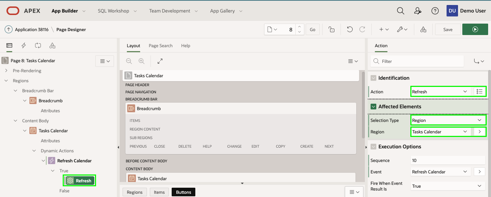
   
8. 애플리케이션 실행상태로 가서 브라우저를 리프레시 합니다.
   캘린더 항목 클릭

   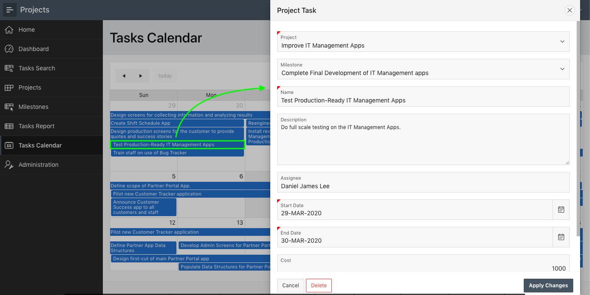

   만약 Name, Start Date 또는 End Date 항목을 변경했다면 Project Task 폼 화면의 **Apply Changes** 를 클릭하면 변경된 내용이 캘린더에 즉시 반영될 것 입니다.

## 요약

이것으로 모듈 8 과 전체 실습을 완료 했습니다. 이제 여러분들은 Shared Component 를 생성하고 측면의 Search 페이지를 향상시키는 방법 그리고 업데이트된 레코드를 Calendar 페이지에 반영하는 한법을 알게 되었습니다.

## 유용한 링크

- APEX on Autonomous https://apex.oracle.com/autonomous
- APEX Collateral [http://apex.oracle.com](http://apex.oracle.com/)
- Tutorials https://apex.oracle.com/en/learn/tutorials
- Community http://apex.oracle.com/community
- External Site + Slack [http://apex.world](http://apex.world/)

